# From Rust to Kubernetes Operator: A Complete Hands-On Tutorial

> **Build a Rust microservice, containerize it, deploy to Kubernetes, package it with Helm, and then automate everything with a custom Operator — all from scratch.**

---

## Who Is This For?

You know some Rust (cargo, structs, async/await) but you've never touched Docker, Kubernetes, or Helm. By the end of this tutorial, you'll have built and deployed a real microservice *and* written an operator that manages it automatically.

**What we're building:** A **GreetingService** — a tiny REST API that returns greetings. Simple enough to understand, real enough to learn from.

---

## Prerequisites

| Tool | Install | Why We Need It |
|------|---------|----------------|
| Rust (1.75+) | [rustup.rs](https://rustup.rs) | Our programming language |
| Docker | [docker.com](https://docs.docker.com/get-docker/) | To package our app into containers |
| kubectl | [kubernetes.io](https://kubernetes.io/docs/tasks/tools/) | To talk to Kubernetes clusters |
| Helm (v3) | [helm.sh](https://helm.sh/docs/intro/install/) | To package Kubernetes deployments |
| A Kubernetes cluster | Minikube, kind, or AKS | Where we deploy everything |
| curl or httpie | Usually pre-installed | To test our API |

> **Tip:** If you don't have a remote cluster, `minikube start` or `kind create cluster` will give you a local one in minutes.

## Choose Your Path (Local vs Remote) Before You Start

Pick one path now and use it consistently through Parts 2-5:

- **Path A — Local cluster (minikube/kind):**
  - Build images locally.
  - Use local image loading (`eval $(minikube docker-env)` / `minikube image load` / `kind load docker-image`).
  - Keep `imagePullPolicy: Never` while learning.
- **Path B — Remote cluster (AKS/EKS/GKE):**
  - Push images to a registry (GHCR/Docker Hub/ACR).
  - Use full image names in manifests (e.g., `ghcr.io/org/repo/greeting-service:TAG`).
  - Set `imagePullPolicy: Always`.

> You can switch paths later, but sticking to one path avoids the most common beginner issue: `ImagePullBackOff`.

---

## Table of Contents

- [Part 1: The Rust Service](#part-1-the-rust-service)
- [Part 2: Dockerize It](#part-2-dockerize-it)
- [Part 3: Kubernetes 101 — Deploy with kubectl](#part-3-kubernetes-101--deploy-with-kubectl)
- [Part 4: Helm — Package It Up](#part-4-helm--package-it-up)
- [Part 5: The Operator — Automate Everything](#part-5-the-operator--automate-everything)
- [Part 6: A Second Microservice (Quote Database)](#part-6-a-second-microservice-quote-database)
- [Part 7: Inter-Service Communication](#part-7-inter-service-communication)
- [Part 8: Networking Deep Dive](#part-8-networking-deep-dive)
- [Part 9: Observability Basics (Bonus)](#part-9-observability-basics-bonus)
- [Part 10: ConfigMaps & Secrets](#part-10-configmaps--secrets)
- [Part 11: Health Checks & Graceful Shutdown](#part-11-health-checks--graceful-shutdown)
- [Part 12: Horizontal Pod Autoscaler (HPA)](#part-12-horizontal-pod-autoscaler-hpa)
- [Part 13: Persistent Storage (StatefulSets & PVCs)](#part-13-persistent-storage-statefulsets--pvcs)
- [Part 14: CI/CD with GitHub Actions](#part-14-cicd-with-github-actions)
- [Part 15: RBAC & Security](#part-15-rbac--security)
- [Part 16: Concepts Cheat Sheet](#part-16-concepts-cheat-sheet)

---

# Part 1: The Rust Service

We'll build a simple REST API with [axum](https://github.com/tokio-rs/axum) — a lightweight, ergonomic Rust web framework built on top of tokio.

**Why axum?** It's simpler than actix-web for beginners, has great error messages, and integrates naturally with the tokio async ecosystem (which we'll also need for the operator later).

## Directory Structure

```
greeting-service/
├── Cargo.toml
└── src/
    └── main.rs
```

## Step 1: Create the Project

```bash
cargo new greeting-service
cd greeting-service
```

## Step 2: Add Dependencies

Replace the contents of `Cargo.toml`:

```toml
[package]
name = "greeting-service"
version = "0.1.0"
edition = "2021"

[dependencies]
axum = "0.7"
tokio = { version = "1", features = ["full"] }
serde = { version = "1", features = ["derive"] }
serde_json = "1"
tracing = "0.1"
tracing-subscriber = "0.3"
```

**What each dependency does:**

| Crate | Purpose |
|-------|---------|
| `axum` | HTTP framework — handles routing, request/response |
| `tokio` | Async runtime — axum needs this to run |
| `serde` / `serde_json` | Serialize/deserialize JSON |
| `tracing` / `tracing-subscriber` | Structured logging (much better than `println!`) |

## Step 3: Write the Service

Replace `src/main.rs` with:

```rust
use axum::{
    extract::State,
    http::StatusCode,
    routing::{get, post},
    Json, Router,
};
use serde::{Deserialize, Serialize};
use std::sync::{Arc, Mutex};
use tracing::info;

// ---------------------------------------------------------------------------
// Data types
// ---------------------------------------------------------------------------

/// A single greeting stored in our service.
#[derive(Debug, Clone, Serialize, Deserialize)]
struct Greeting {
    name: String,
    message: String,
}

/// Shared application state.
/// Arc = thread-safe reference counting.
/// Mutex = safe interior mutability (only one writer at a time).
type AppState = Arc<Mutex<Vec<Greeting>>>;

// ---------------------------------------------------------------------------
// Handlers — each function handles one HTTP endpoint
// ---------------------------------------------------------------------------

/// GET /health — Kubernetes will call this to check if our pod is alive.
async fn health() -> &'static str {
    "OK"
}

/// GET /greetings — return all stored greetings as JSON.
async fn list_greetings(State(state): State<AppState>) -> Json<Vec<Greeting>> {
    let greetings = state.lock().unwrap().clone();
    Json(greetings)
}

/// POST /greetings — add a new greeting.
/// Expects JSON body: {"name": "Alice", "message": "Hello!"}
async fn add_greeting(
    State(state): State<AppState>,
    Json(greeting): Json<Greeting>,
) -> (StatusCode, Json<Greeting>) {
    info!(name = %greeting.name, "Adding new greeting");
    state.lock().unwrap().push(greeting.clone());
    (StatusCode::CREATED, Json(greeting))
}

/// GET / — a friendly landing page.
async fn root() -> &'static str {
    "Welcome to the Greeting Service! Try GET /greetings or POST /greetings"
}

// ---------------------------------------------------------------------------
// Main — wire everything together
// ---------------------------------------------------------------------------

#[tokio::main]
async fn main() {
    // Initialize structured logging.
    tracing_subscriber::fmt::init();

    // Start with some default greetings so the API isn't empty.
    let initial = vec![
        Greeting {
            name: "World".into(),
            message: "Hello, World!".into(),
        },
        Greeting {
            name: "Rustacean".into(),
            message: "Hey there, fellow crab! 🦀".into(),
        },
    ];
    let state: AppState = Arc::new(Mutex::new(initial));

    // Build the router — this maps URLs to handler functions.
    let app = Router::new()
        .route("/", get(root))
        .route("/health", get(health))
        .route("/greetings", get(list_greetings).post(add_greeting))
        .with_state(state);

    // Read port from environment variable, default to 3000.
    let port = std::env::var("PORT").unwrap_or_else(|_| "3000".into());
    let addr = format!("0.0.0.0:{port}");

    info!("Greeting service listening on {addr}");
    let listener = tokio::net::TcpListener::bind(&addr).await.unwrap();
    axum::serve(listener, app).await.unwrap();
}
```

## Step 4: Run and Test It

```bash
cargo run
```

In another terminal:

```bash
# Check the landing page
curl http://localhost:3000/

# List greetings
curl http://localhost:3000/greetings

# Add a greeting
curl -X POST http://localhost:3000/greetings \
  -H "Content-Type: application/json" \
  -d '{"name": "Tutorial Reader", "message": "You are doing great!"}'

# Verify it was added
curl http://localhost:3000/greetings

# Health check
curl http://localhost:3000/health
```

**Expected output from `GET /greetings`:**
```json
[
  {"name": "World", "message": "Hello, World!"},
  {"name": "Rustacean", "message": "Hey there, fellow crab! 🦀"},
  {"name": "Tutorial Reader", "message": "You are doing great!"}
]
```

> ### ✅ What Just Happened?
>
> You built a complete REST API in Rust with:
> - **GET /** — landing page
> - **GET /health** — health check endpoint (Kubernetes will use this later)
> - **GET /greetings** — list all greetings
> - **POST /greetings** — add a new greeting
>
> The service stores greetings in memory (they'll disappear on restart — that's fine for learning). It reads its port from the `PORT` environment variable, which will be useful when we containerize it.

---

# Part 2: Dockerize It

**Why Docker?** Your Rust binary works on *your* machine, but Kubernetes doesn't run raw binaries — it runs *containers*. A container is like a lightweight, portable box that contains your app and everything it needs to run.

Think of it this way:
- **Binary** = a book
- **Container** = a book in a sealed, labeled shipping box with instructions

## Directory Structure

```
greeting-service/
├── Cargo.toml
├── Dockerfile          ← NEW
├── .dockerignore       ← NEW
└── src/
    └── main.rs
```

## Step 1: Create .dockerignore

This works like `.gitignore` — it tells Docker which files to skip when building.

Create `.dockerignore`:

```
target/
.git/
.gitignore
*.md
```

**Why?** The `target/` directory can be gigabytes. Sending it to Docker would be slow and wasteful.

## Step 2: Create the Dockerfile

Create `Dockerfile`:

```dockerfile
# ============================================================================
# Stage 1: Build — compile our Rust code
# ============================================================================
# We use the official Rust image, which has cargo and rustc pre-installed.
FROM rust:1.82-slim AS builder

WORKDIR /app

# Copy dependency files first.
# Docker caches layers — if Cargo.toml hasn't changed, it won't re-download
# all dependencies. This makes rebuilds MUCH faster.
COPY Cargo.toml Cargo.lock ./

# Create a dummy main.rs so cargo can download and compile dependencies.
RUN mkdir src && echo "fn main() {}" > src/main.rs
RUN cargo build --release
RUN rm -rf src

# Now copy the real source code and build for real.
COPY src ./src
# Touch main.rs so cargo knows it changed (otherwise it might use the cached
# dummy build).
RUN touch src/main.rs
RUN cargo build --release

# ============================================================================
# Stage 2: Runtime — create a tiny final image
# ============================================================================
# debian:bookworm-slim is ~80MB vs ~1.5GB for the full Rust image.
FROM debian:bookworm-slim

# Install CA certificates (needed if your app makes HTTPS calls).
RUN apt-get update && apt-get install -y --no-install-recommends \
    ca-certificates \
    && rm -rf /var/lib/apt/lists/*

# Create a non-root user for security.
# Running as root inside containers is a bad practice.
RUN useradd --create-home appuser
USER appuser

# Copy ONLY the compiled binary from the builder stage.
COPY --from=builder /app/target/release/greeting-service /usr/local/bin/greeting-service

# Document which port the app uses (this doesn't actually open the port —
# it's just metadata for humans and tools).
EXPOSE 3000

# Set the default port via environment variable.
ENV PORT=3000

# Run our binary.
CMD ["greeting-service"]
```

> **Why multi-stage?** The Rust compiler, source code, and intermediate build
> artifacts are huge (~1.5GB). Our final binary is ~5-10MB. Multi-stage builds
> let us compile in a big image but ship a tiny one.

## Step 3: Build the Image

```bash
# Make sure you have a Cargo.lock file (Docker needs it).
cargo generate-lockfile

# Build the Docker image.
# -t gives it a name:tag. Think of tags like version numbers.
docker build -t greeting-service:latest .
```

This will take a few minutes the first time (downloading base images, compiling).

## Step 4: Run and Test the Container

```bash
# Run the container.
# -p 3000:3000 maps port 3000 on your machine to port 3000 in the container.
# -d runs it in the background (detached).
docker run -d -p 3000:3000 --name greeting greeting-service:latest

# Test it — same curl commands as before!
curl http://localhost:3000/greetings

# Check the container logs.
docker logs greeting

# Stop and remove the container when done.
docker stop greeting && docker rm greeting
```

## Step 5: Push to a Registry (Required for Kubernetes)

Kubernetes needs to pull your image from a container registry. If using a local
cluster (minikube/kind), you can skip this step.

```bash
# Example with Docker Hub (replace YOUR_USERNAME):
docker tag greeting-service:latest YOUR_USERNAME/greeting-service:latest
docker push YOUR_USERNAME/greeting-service:latest

# Example with Azure Container Registry:
# az acr login --name YOUR_ACR
# docker tag greeting-service:latest YOUR_ACR.azurecr.io/greeting-service:latest
# docker push YOUR_ACR.azurecr.io/greeting-service:latest
```

> **Using minikube?** Run `eval $(minikube docker-env)` before `docker build`
> so the image is available directly inside minikube without pushing.

> ### ✅ What Just Happened?
>
> You created a **multi-stage Docker build** that:
> 1. **Stage 1 (builder):** Uses a full Rust image to compile your code
> 2. **Stage 2 (runtime):** Copies just the tiny binary into a minimal Debian image
>
> Your final image is ~80-100MB instead of ~1.5GB. It runs as a non-root user
> for security, and it behaves identically on any machine that has Docker.

---

# Part 3: Kubernetes 101 — Deploy with kubectl

**Why Kubernetes?** Docker runs one container on one machine. Kubernetes runs
containers across *many* machines, handles crashes (restarts them), scales up
under load, and manages networking. It's the industry standard for running
containers in production.

## Key Concepts (Quick Version)

| Concept | What It Is | Real-World Analogy |
|---------|-----------|-------------------|
| **Pod** | Smallest unit — one or more containers | A single office worker at a desk |
| **Deployment** | Manages pods — ensures N copies are running | A department manager who hires replacements |
| **Service** | Stable network address for pods | The department's phone number (doesn't change when people leave) |
| **Namespace** | Logical isolation (like folders) | Different floors in a building |

## Directory Structure

```
greeting-service/
├── Cargo.toml
├── Dockerfile
├── .dockerignore
├── src/
│   └── main.rs
└── k8s/                ← NEW
    ├── namespace.yaml
    ├── deployment.yaml
    └── service.yaml
```

## Step 1: Create the Namespace

Namespaces keep things organized. Think of them as separate folders in
Kubernetes.

Create `k8s/namespace.yaml`:

```yaml
apiVersion: v1
kind: Namespace
metadata:
  name: greeting
  labels:
    app: greeting-service
```

Apply it:

```bash
kubectl apply -f k8s/namespace.yaml
```

Verify:

```bash
kubectl get namespaces | grep greeting
```

## Step 2: Create the Deployment

A Deployment tells Kubernetes: "I want N copies of this container running at
all times. If one crashes, start a new one."

Create `k8s/deployment.yaml`:

```yaml
apiVersion: apps/v1
kind: Deployment
metadata:
  name: greeting-service
  namespace: greeting
  labels:
    app: greeting-service
spec:
  # How many copies (replicas) of our pod to run.
  replicas: 2
  # How the Deployment finds which pods it owns.
  selector:
    matchLabels:
      app: greeting-service
  template:
    # This is the pod template — Kubernetes uses this as a blueprint.
    metadata:
      labels:
        app: greeting-service
    spec:
      containers:
        - name: greeting-service
          # IMPORTANT: Replace this with your actual image path.
          # For minikube with local images, use: greeting-service:latest
          # For Docker Hub: YOUR_USERNAME/greeting-service:latest
          # For ACR: YOUR_ACR.azurecr.io/greeting-service:latest
          image: greeting-service:latest
          # "Never" = use local image. Change to "Always" for remote registries.
          imagePullPolicy: Never
          ports:
            - containerPort: 3000
          env:
            - name: PORT
              value: "3000"
          # Liveness probe: Kubernetes restarts the pod if this fails.
          # "Is the process alive and responding?"
          livenessProbe:
            httpGet:
              path: /health
              port: 3000
            initialDelaySeconds: 5
            periodSeconds: 10
          # Readiness probe: Kubernetes only sends traffic if this passes.
          # "Is the pod ready to handle requests?"
          readinessProbe:
            httpGet:
              path: /health
              port: 3000
            initialDelaySeconds: 3
            periodSeconds: 5
          # Resource limits prevent one pod from consuming all cluster resources.
          resources:
            requests:
              memory: "64Mi"
              cpu: "100m"       # 100 millicores = 0.1 CPU
            limits:
              memory: "128Mi"
              cpu: "250m"
```

Apply it:

```bash
kubectl apply -f k8s/deployment.yaml
```

Verify:

```bash
# Watch pods come up (Ctrl+C to stop).
kubectl get pods -n greeting -w

# Check deployment status.
kubectl get deployment -n greeting

# Look at detailed info if something goes wrong.
kubectl describe deployment greeting-service -n greeting
```

You should see 2 pods in the `Running` state.

## Step 3: Create the Service

Pods get random IP addresses that change when they restart. A Service gives
them a *stable* address that other apps can use.

Create `k8s/service.yaml`:

```yaml
apiVersion: v1
kind: Service
metadata:
  name: greeting-service
  namespace: greeting
  labels:
    app: greeting-service
spec:
  # ClusterIP = accessible only inside the cluster (default, most secure).
  # NodePort = accessible from outside via a high port on each node.
  # LoadBalancer = gets an external IP (works on cloud providers / minikube tunnel).
  type: ClusterIP
  selector:
    # This must match the pod labels from the Deployment.
    app: greeting-service
  ports:
    - protocol: TCP
      port: 80          # The port OTHER services use to reach us.
      targetPort: 3000   # The port our container actually listens on.
```

Apply it:

```bash
kubectl apply -f k8s/service.yaml
```

Verify:

```bash
kubectl get service -n greeting
```

## Step 4: Test Your Deployment

```bash
# Option A: Port-forward (works everywhere).
# This creates a tunnel from your machine to the Kubernetes service.
kubectl port-forward -n greeting service/greeting-service 8080:80 &

curl http://localhost:8080/greetings
curl http://localhost:8080/health

# Don't forget to stop the port-forward when done.
# Use: fg (to bring it to foreground) then Ctrl+C
# Or: kill %1

# Option B: If using minikube with LoadBalancer type:
# minikube tunnel   (in another terminal)
# Then use the EXTERNAL-IP shown in: kubectl get svc -n greeting
```

## Troubleshooting

```bash
# Pod stuck in "ImagePullBackOff"?
# → The image isn't accessible. Check image name and imagePullPolicy.
kubectl describe pod -n greeting <POD_NAME>

# Pod stuck in "CrashLoopBackOff"?
# → The app is crashing. Check the logs.
kubectl logs -n greeting <POD_NAME>

# Pod is "Running" but not responding?
# → Check readiness probe and port configuration.
kubectl get endpoints -n greeting
```

> ### ✅ What Just Happened?
>
> You deployed your greeting service to Kubernetes with:
> - **Namespace** — isolated environment for your app
> - **Deployment** — ensures 2 replicas are always running, restarts crashed pods
> - **Service** — stable network address so traffic reaches your pods
> - **Health checks** — Kubernetes automatically monitors and restarts unhealthy pods
>
> Kubernetes is now managing your app. Kill a pod (`kubectl delete pod -n greeting <name>`) and watch a new one appear automatically!

---

# Part 4: Helm — Package It Up

**Why Helm?** Imagine you need to deploy your service to dev, staging, and
production — each with different replica counts, image tags, and resource
limits. Without Helm, you'd copy-paste YAML files and manually edit values.
Helm lets you *template* your YAML and change values without editing files.

Think of it this way:
- **kubectl + YAML** = cooking from a fixed recipe every time
- **Helm** = a recipe with blanks you can fill in ("add ___ cups of sugar")

## Directory Structure

```
greeting-service/
├── Cargo.toml
├── Dockerfile
├── .dockerignore
├── src/
│   └── main.rs
├── k8s/
│   └── (raw manifests from Part 3)
└── helm/
    └── greeting-service/        ← NEW (the Helm chart)
        ├── Chart.yaml
        ├── values.yaml
        └── templates/
            ├── _helpers.tpl
            ├── namespace.yaml
            ├── deployment.yaml
            └── service.yaml
```

## Step 1: Create the Chart Metadata

Create `helm/greeting-service/Chart.yaml`:

```yaml
apiVersion: v2
name: greeting-service
description: A Helm chart for the Greeting Service
type: application
version: 0.1.0        # Chart version (the "package" version)
appVersion: "0.1.0"   # App version (your Rust service version)
```

## Step 2: Define Default Values

This is the "fill in the blanks" file. Users override these values per
environment.

Create `helm/greeting-service/values.yaml`:

```yaml
# -- Number of pod replicas
replicaCount: 2

image:
  # -- Container image repository
  repository: greeting-service
  # -- Image pull policy (use "Always" for remote registries)
  pullPolicy: Never
  # -- Image tag (defaults to chart appVersion if not set)
  tag: "latest"

service:
  # -- Kubernetes service type
  type: ClusterIP
  # -- Service port
  port: 80

container:
  # -- Port the Rust application listens on
  port: 3000

resources:
  requests:
    memory: "64Mi"
    cpu: "100m"
  limits:
    memory: "128Mi"
    cpu: "250m"

# -- Namespace to deploy into
namespace: greeting

healthCheck:
  # -- Path for liveness and readiness probes
  path: /health
```

## Step 3: Create Template Helpers

These are reusable snippets used across templates.

Create `helm/greeting-service/templates/_helpers.tpl`:

```
{{/*
Common name for all resources.
*/}}
{{- define "greeting-service.name" -}}
{{- default .Chart.Name .Values.nameOverride | trunc 63 | trimSuffix "-" }}
{{- end }}

{{/*
Fully qualified app name.
*/}}
{{- define "greeting-service.fullname" -}}
{{- if .Values.fullnameOverride }}
{{- .Values.fullnameOverride | trunc 63 | trimSuffix "-" }}
{{- else }}
{{- .Release.Name | trunc 63 | trimSuffix "-" }}
{{- end }}
{{- end }}

{{/*
Common labels applied to every resource.
*/}}
{{- define "greeting-service.labels" -}}
app: {{ include "greeting-service.name" . }}
app.kubernetes.io/name: {{ include "greeting-service.name" . }}
app.kubernetes.io/instance: {{ .Release.Name }}
app.kubernetes.io/version: {{ .Chart.AppVersion | quote }}
app.kubernetes.io/managed-by: {{ .Release.Service }}
helm.sh/chart: {{ .Chart.Name }}-{{ .Chart.Version }}
{{- end }}

{{/*
Selector labels — used by Deployments and Services to find pods.
*/}}
{{- define "greeting-service.selectorLabels" -}}
app: {{ include "greeting-service.name" . }}
app.kubernetes.io/instance: {{ .Release.Name }}
{{- end }}
```

## Step 4: Create the Templates

These look like the YAML from Part 3 but with `{{ }}` placeholders filled from
`values.yaml`.

Create `helm/greeting-service/templates/namespace.yaml`:

```yaml
apiVersion: v1
kind: Namespace
metadata:
  name: {{ .Values.namespace }}
  labels:
    {{- include "greeting-service.labels" . | nindent 4 }}
```

Create `helm/greeting-service/templates/deployment.yaml`:

```yaml
apiVersion: apps/v1
kind: Deployment
metadata:
  name: {{ include "greeting-service.fullname" . }}
  namespace: {{ .Values.namespace }}
  labels:
    {{- include "greeting-service.labels" . | nindent 4 }}
spec:
  replicas: {{ .Values.replicaCount }}
  selector:
    matchLabels:
      {{- include "greeting-service.selectorLabels" . | nindent 6 }}
  template:
    metadata:
      labels:
        {{- include "greeting-service.selectorLabels" . | nindent 8 }}
    spec:
      containers:
        - name: {{ include "greeting-service.name" . }}
          image: "{{ .Values.image.repository }}:{{ .Values.image.tag | default .Chart.AppVersion }}"
          imagePullPolicy: {{ .Values.image.pullPolicy }}
          ports:
            - containerPort: {{ .Values.container.port }}
          env:
            - name: PORT
              value: {{ .Values.container.port | quote }}
          livenessProbe:
            httpGet:
              path: {{ .Values.healthCheck.path }}
              port: {{ .Values.container.port }}
            initialDelaySeconds: 5
            periodSeconds: 10
          readinessProbe:
            httpGet:
              path: {{ .Values.healthCheck.path }}
              port: {{ .Values.container.port }}
            initialDelaySeconds: 3
            periodSeconds: 5
          resources:
            {{- toYaml .Values.resources | nindent 12 }}
```

Create `helm/greeting-service/templates/service.yaml`:

```yaml
apiVersion: v1
kind: Service
metadata:
  name: {{ include "greeting-service.fullname" . }}
  namespace: {{ .Values.namespace }}
  labels:
    {{- include "greeting-service.labels" . | nindent 4 }}
spec:
  type: {{ .Values.service.type }}
  selector:
    {{- include "greeting-service.selectorLabels" . | nindent 4 }}
  ports:
    - protocol: TCP
      port: {{ .Values.service.port }}
      targetPort: {{ .Values.container.port }}
```

## Step 5: Lint and Preview

```bash
# Validate the chart for errors.
helm lint helm/greeting-service/

# Render the templates WITHOUT deploying (dry run).
# This shows you the exact YAML that Helm would send to Kubernetes.
helm template my-greeting helm/greeting-service/
```

Check the output — it should look like the raw YAML from Part 3, but with all
the values filled in.

## Step 6: Deploy with Helm

```bash
# Install the chart.
# "my-greeting" is the release name — like a deployment instance.
helm install my-greeting helm/greeting-service/

# Check the release.
helm list

# Check Kubernetes resources.
kubectl get all -n greeting
```

## Step 7: Override Values per Environment

This is where Helm really shines.

```bash
# Scale to 5 replicas for production — no YAML editing needed:
helm upgrade my-greeting helm/greeting-service/ \
  --set replicaCount=5

# Or use a values file for more complex overrides:
# Create a file called values-prod.yaml:
#   replicaCount: 5
#   image:
#     pullPolicy: Always
#     tag: "1.0.0"
#   resources:
#     limits:
#       memory: "256Mi"
#       cpu: "500m"

# Then:
# helm upgrade my-greeting helm/greeting-service/ -f values-prod.yaml
```

## Useful Helm Commands

```bash
# See what's deployed.
helm list

# Check release status.
helm status my-greeting

# See release history (for rollbacks).
helm history my-greeting

# Rollback to a previous version.
helm rollback my-greeting 1

# Uninstall (remove everything).
helm uninstall my-greeting
```

> ### ✅ What Just Happened?
>
> You created a **Helm chart** that:
> - **Templates** your Kubernetes YAML with configurable values
> - **Packages** Namespace + Deployment + Service into one deployable unit
> - Lets you **override values** per environment without editing YAML
> - Supports **upgrades and rollbacks** with a single command
>
> Instead of `kubectl apply -f` on multiple files, you run `helm install` once.
> Instead of editing YAML for production, you pass `--set replicaCount=5`.

---

# Checkpoint: Verify Everything Before Part 5 (Operator)

Before continuing, confirm Parts 1-4 are working. If any check fails, fix it first.

```bash
# 1) Rust service works locally
curl http://localhost:3000/health

# 2) Docker image exists
docker images | grep greeting-service

# 3) Kubernetes deployment is healthy
kubectl get pods -n greeting
kubectl get svc -n greeting

# 4) Helm release is healthy (if you followed Part 4)
helm list -n greeting
helm status my-greeting -n greeting
```

If all green, you're ready for the biggest jump: building the operator.

---

# Part 5: The Operator — Automate Everything

**Why an Operator?** Helm deploys your app, but it doesn't *watch* it. If
someone accidentally deletes the Service, Helm won't recreate it. An Operator
is a program that runs *inside* Kubernetes, watches your resources, and
constantly ensures reality matches your desired state.

Think of it this way:
- **Helm** = a contractor who builds your house and leaves
- **Operator** = a live-in caretaker who fixes anything that breaks

We'll build an operator that:
1. Defines a **Custom Resource Definition (CRD)** called `GreetingService`
2. **Watches** for GreetingService resources in the cluster
3. **Creates/updates** a Deployment and Service to match the CRD spec
4. **Continuously reconciles** — if someone deletes the Deployment, the operator recreates it

## Directory Structure

```
greeting-operator/
├── Cargo.toml
├── src/
│   └── main.rs
├── Dockerfile
└── manifests/
    ├── crd.yaml
    ├── operator-deployment.yaml
    ├── rbac.yaml
    └── example-greetingservice.yaml
```

## Step 1: Create the Operator Project

```bash
# Go back to the parent directory (not inside greeting-service).
cd ..
cargo new greeting-operator
cd greeting-operator
```

## Step 2: Add Dependencies

Replace `Cargo.toml`:

```toml
[package]
name = "greeting-operator"
version = "0.1.0"
edition = "2021"

[dependencies]
# kube-rs — THE Rust library for building Kubernetes operators.
kube = { version = "0.98", features = ["runtime", "derive", "client"] }
# k8s-openapi — Rust types for every built-in Kubernetes resource.
k8s-openapi = { version = "0.24", features = ["latest"] }
# Controller runtime support.
futures = "0.3"
# Serialization.
serde = { version = "1", features = ["derive"] }
serde_json = "1"
# Async runtime.
tokio = { version = "1", features = ["full"] }
# Logging.
tracing = "0.1"
tracing-subscriber = "0.3"
# Error handling.
thiserror = "2"
# JSON patch for applying updates.
json-patch = "4"
```

**Why these crates?**

| Crate | Purpose |
|-------|---------|
| `kube` | Talk to Kubernetes API, watch resources, run controller loops |
| `k8s-openapi` | Rust structs for Pods, Deployments, Services, etc. |
| `futures` | Async stream utilities (the controller loop is an async stream) |
| `thiserror` | Clean error types |
| `json-patch` | Generate JSON patches for updating resources |

## Step 3: Write the Operator

This is the big one. Read the comments carefully — they explain every piece.

Replace `src/main.rs`:

```rust
use futures::StreamExt;
use k8s_openapi::{
    api::{
        apps::v1::{Deployment, DeploymentSpec},
        core::v1::{Container, ContainerPort, EnvVar, Pod, Service, ServicePort, ServiceSpec},
    },
    apimachinery::pkg::{
        apis::meta::v1::LabelSelector,
        util::intstr::IntOrString,
    },
};
use kube::{
    api::{Api, ObjectMeta, Patch, PatchParams, PostParams},
    client::Client,
    runtime::controller::{Action, Controller},
    CustomResource, Resource, ResourceExt,
};
use serde::{Deserialize, Serialize};
use std::{collections::BTreeMap, sync::Arc};
use tracing::{error, info, warn};

// ===========================================================================
// Step A: Define the Custom Resource (CRD)
// ===========================================================================

/// This macro generates:
/// - A `GreetingService` struct (the Kubernetes resource)
/// - The CRD YAML schema (we'll export this in Step 5)
///
/// When someone creates a GreetingService in Kubernetes, these are the fields
/// they can set.
#[derive(CustomResource, Debug, Clone, Serialize, Deserialize, schemars::JsonSchema)]
#[kube(
    group = "example.com",
    version = "v1",
    kind = "GreetingService",
    namespaced,
    status = "GreetingServiceStatus",
    shortname = "gs"
)]
pub struct GreetingServiceSpec {
    /// Container image to deploy (e.g., "myuser/greeting-service:latest").
    pub image: String,
    /// Number of pod replicas.
    pub replicas: i32,
    /// Port the container listens on.
    #[serde(default = "default_port")]
    pub port: i32,
    /// Optional greeting message set via environment variable.
    #[serde(default)]
    pub greeting_message: Option<String>,
}

fn default_port() -> i32 {
    3000
}

/// Status subresource — the operator writes this to report what it did.
#[derive(Debug, Clone, Serialize, Deserialize, schemars::JsonSchema)]
pub struct GreetingServiceStatus {
    pub ready_replicas: i32,
    pub message: String,
}

// ===========================================================================
// Step B: Error type
// ===========================================================================

#[derive(Debug, thiserror::Error)]
pub enum Error {
    #[error("Kubernetes API error: {0}")]
    Kube(#[from] kube::Error),

    #[error("Missing object key: {0}")]
    MissingObjectKey(&'static str),

    #[error("Serialization error: {0}")]
    Serde(#[from] serde_json::Error),
}

/// Context shared across all reconcile calls.
struct Context {
    client: Client,
}

// ===========================================================================
// Step C: The reconcile function — the HEART of the operator
// ===========================================================================

/// This function is called every time a GreetingService resource changes.
///
/// The operator pattern:
/// 1. Read the DESIRED state (from the GreetingService CR)
/// 2. Read the CURRENT state (from the cluster)
/// 3. Make changes to move current → desired
///
/// This function must be IDEMPOTENT — calling it multiple times with the same
/// input should produce the same result.
async fn reconcile(gs: Arc<GreetingService>, ctx: Arc<Context>) -> Result<Action, Error> {
    let client = &ctx.client;

    let name = gs.name_any();
    let namespace = gs.namespace().ok_or(Error::MissingObjectKey("namespace"))?;

    info!(%name, %namespace, "Reconciling GreetingService");

    // Build the labels that tie everything together.
    let labels = BTreeMap::from([
        ("app".to_string(), name.clone()),
        ("managed-by".to_string(), "greeting-operator".to_string()),
    ]);

    // ------ Create or update the Deployment ------
    let deployment = build_deployment(&gs, &labels);
    let deploy_api: Api<Deployment> = Api::namespaced(client.clone(), &namespace);
    deploy_api
        .patch(
            &name,
            &PatchParams::apply("greeting-operator"),
            &Patch::Apply(deployment),
        )
        .await?;
    info!(%name, "Deployment applied");

    // ------ Create or update the Service ------
    let service = build_service(&gs, &labels);
    let svc_api: Api<Service> = Api::namespaced(client.clone(), &namespace);
    svc_api
        .patch(
            &name,
            &PatchParams::apply("greeting-operator"),
            &Patch::Apply(service),
        )
        .await?;
    info!(%name, "Service applied");

    // ------ Update the status subresource ------
    let status = serde_json::json!({
        "status": GreetingServiceStatus {
            ready_replicas: gs.spec.replicas,
            message: format!("Deployment and Service for '{}' are configured", name),
        }
    });
    let gs_api: Api<GreetingService> = Api::namespaced(client.clone(), &namespace);
    gs_api
        .patch_status(
            &name,
            &PatchParams::apply("greeting-operator"),
            &Patch::Merge(status),
        )
        .await?;

    info!(%name, "Reconciliation complete");

    // Re-reconcile after 5 minutes even if nothing changes (as a safety net).
    Ok(Action::requeue(std::time::Duration::from_secs(300)))
}

// ===========================================================================
// Step D: Build the Kubernetes resources
// ===========================================================================

/// Construct the Deployment that the operator will manage.
fn build_deployment(gs: &GreetingService, labels: &BTreeMap<String, String>) -> Deployment {
    let name = gs.name_any();
    let namespace = gs.namespace().unwrap_or_default();

    // Build environment variables for the container.
    let mut env_vars = vec![EnvVar {
        name: "PORT".to_string(),
        value: Some(gs.spec.port.to_string()),
        ..Default::default()
    }];

    if let Some(ref msg) = gs.spec.greeting_message {
        env_vars.push(EnvVar {
            name: "GREETING_MESSAGE".to_string(),
            value: Some(msg.clone()),
            ..Default::default()
        });
    }

    Deployment {
        metadata: ObjectMeta {
            name: Some(name.clone()),
            namespace: Some(namespace),
            labels: Some(labels.clone()),
            // owner_references ensures that if the GreetingService CR is
            // deleted, Kubernetes automatically garbage-collects the Deployment.
            owner_references: Some(vec![gs.controller_owner_ref(&()).unwrap()]),
            ..Default::default()
        },
        spec: Some(DeploymentSpec {
            replicas: Some(gs.spec.replicas),
            selector: LabelSelector {
                match_labels: Some(labels.clone()),
                ..Default::default()
            },
            template: k8s_openapi::api::core::v1::PodTemplateSpec {
                metadata: Some(ObjectMeta {
                    labels: Some(labels.clone()),
                    ..Default::default()
                }),
                spec: Some(k8s_openapi::api::core::v1::PodSpec {
                    containers: vec![Container {
                        name: name.clone(),
                        image: Some(gs.spec.image.clone()),
                        ports: Some(vec![ContainerPort {
                            container_port: gs.spec.port,
                            ..Default::default()
                        }]),
                        env: Some(env_vars),
                        ..Default::default()
                    }],
                    ..Default::default()
                }),
            },
            ..Default::default()
        }),
        ..Default::default()
    }
}

/// Construct the Service that the operator will manage.
fn build_service(gs: &GreetingService, labels: &BTreeMap<String, String>) -> Service {
    let name = gs.name_any();
    let namespace = gs.namespace().unwrap_or_default();

    Service {
        metadata: ObjectMeta {
            name: Some(name),
            namespace: Some(namespace),
            labels: Some(labels.clone()),
            owner_references: Some(vec![gs.controller_owner_ref(&()).unwrap()]),
            ..Default::default()
        },
        spec: Some(ServiceSpec {
            selector: Some(labels.clone()),
            ports: Some(vec![ServicePort {
                port: 80,
                target_port: Some(IntOrString::Int(gs.spec.port)),
                ..Default::default()
            }]),
            ..Default::default()
        }),
        ..Default::default()
    }
}

// ===========================================================================
// Step E: Error handler
// ===========================================================================

/// Called when reconcile() returns an error.
fn error_policy(gs: Arc<GreetingService>, error: &Error, _ctx: Arc<Context>) -> Action {
    let name = gs.name_any();
    error!(%name, %error, "Reconciliation failed, retrying in 30s");
    // Retry after 30 seconds on error.
    Action::requeue(std::time::Duration::from_secs(30))
}

// ===========================================================================
// Step F: Main — start the controller
// ===========================================================================

#[tokio::main]
async fn main() -> Result<(), Box<dyn std::error::Error>> {
    tracing_subscriber::fmt::init();

    info!("Starting Greeting Operator");

    // Connect to the Kubernetes API.
    // Inside a cluster, this uses the service account token automatically.
    // Outside (for development), it uses your ~/.kube/config.
    let client = Client::try_default().await?;

    // Create an API handle for our custom resource.
    let gs_api: Api<GreetingService> = Api::all(client.clone());

    // Verify the CRD exists in the cluster.
    // If it doesn't, this will return an error with a helpful message.
    info!("Checking if GreetingService CRD is installed...");
    if let Err(e) = gs_api.list(&Default::default()).await {
        error!("GreetingService CRD not found. Install it first with:");
        error!("  kubectl apply -f manifests/crd.yaml");
        return Err(e.into());
    }
    info!("CRD found. Starting controller...");

    let context = Arc::new(Context { client });

    // Build and run the controller.
    Controller::new(gs_api, kube::runtime::watcher::Config::default())
        // Watch Deployments that we own (so we reconcile if someone modifies them).
        .owns(
            Api::<Deployment>::all(context.client.clone()),
            kube::runtime::watcher::Config::default(),
        )
        // Watch Services that we own.
        .owns(
            Api::<Service>::all(context.client.clone()),
            kube::runtime::watcher::Config::default(),
        )
        .run(reconcile, error_policy, context)
        .for_each(|result| async move {
            match result {
                Ok((_obj, action)) => {
                    info!(?action, "Reconcile succeeded");
                }
                Err(e) => {
                    warn!("Reconcile error: {:?}", e);
                }
            }
        })
        .await;

    Ok(())
}
```

## Step 4: Add the Schema Dependency

The CRD derive macro needs `schemars`. Add it:

```bash
cargo add schemars
```

## Step 5: Generate and Create the CRD

First, let's verify the code compiles:

```bash
cargo build
```

Now create the CRD YAML. The `kube` derive macro generates the schema, but for
deployment we need a static YAML file.

Create `manifests/crd.yaml`:

```yaml
apiVersion: apiextensions.k8s.io/v1
kind: CustomResourceDefinition
metadata:
  name: greetingservices.example.com
spec:
  group: example.com
  names:
    kind: GreetingService
    plural: greetingservices
    singular: greetingservice
    shortNames:
      - gs
  scope: Namespaced
  versions:
    - name: v1
      served: true
      storage: true
      schema:
        openAPIV3Schema:
          type: object
          properties:
            spec:
              type: object
              required:
                - image
                - replicas
              properties:
                image:
                  type: string
                  description: "Container image for the greeting service"
                replicas:
                  type: integer
                  format: int32
                  minimum: 1
                  description: "Number of replicas"
                port:
                  type: integer
                  format: int32
                  default: 3000
                  description: "Container port"
                greeting_message:
                  type: string
                  description: "Optional custom greeting message"
            status:
              type: object
              properties:
                ready_replicas:
                  type: integer
                  format: int32
                message:
                  type: string
      subresources:
        status: {}
      additionalPrinterColumns:
        - name: Image
          type: string
          jsonPath: .spec.image
        - name: Replicas
          type: integer
          jsonPath: .spec.replicas
        - name: Status
          type: string
          jsonPath: .status.message
        - name: Age
          type: date
          jsonPath: .metadata.creationTimestamp
```

Apply it to the cluster:

```bash
kubectl apply -f manifests/crd.yaml
```

Verify:

```bash
# The CRD should appear in the API.
kubectl get crd greetingservices.example.com

# You can now use "gs" as a shortname!
kubectl get gs --all-namespaces
```

## Step 6: Set Up RBAC

The operator needs *permission* to read/write Deployments, Services, and our
CRD. Kubernetes uses Role-Based Access Control (RBAC) for this.

Create `manifests/rbac.yaml`:

```yaml
---
# ServiceAccount — the identity our operator pod runs as.
apiVersion: v1
kind: ServiceAccount
metadata:
  name: greeting-operator
  namespace: greeting

---
# ClusterRole — defines WHAT the operator is allowed to do.
apiVersion: rbac.authorization.k8s.io/v1
kind: ClusterRole
metadata:
  name: greeting-operator
rules:
  # Permission to manage our custom resource.
  - apiGroups: ["example.com"]
    resources: ["greetingservices", "greetingservices/status"]
    verbs: ["get", "list", "watch", "create", "update", "patch", "delete"]
  # Permission to manage Deployments.
  - apiGroups: ["apps"]
    resources: ["deployments"]
    verbs: ["get", "list", "watch", "create", "update", "patch", "delete"]
  # Permission to manage Services.
  - apiGroups: [""]
    resources: ["services"]
    verbs: ["get", "list", "watch", "create", "update", "patch", "delete"]
  # Permission to watch events (useful for debugging).
  - apiGroups: [""]
    resources: ["events"]
    verbs: ["create", "patch"]

---
# ClusterRoleBinding — links the ServiceAccount to the ClusterRole.
apiVersion: rbac.authorization.k8s.io/v1
kind: ClusterRoleBinding
metadata:
  name: greeting-operator
subjects:
  - kind: ServiceAccount
    name: greeting-operator
    namespace: greeting
roleRef:
  kind: ClusterRole
  name: greeting-operator
  apiGroup: rbac.authorization.k8s.io
```

Apply it:

```bash
kubectl apply -f manifests/rbac.yaml
```

## Step 7: Create the Operator Deployment

Create `manifests/operator-deployment.yaml`:

```yaml
apiVersion: apps/v1
kind: Deployment
metadata:
  name: greeting-operator
  namespace: greeting
  labels:
    app: greeting-operator
spec:
  replicas: 1    # Only ONE operator instance should run at a time.
  selector:
    matchLabels:
      app: greeting-operator
  template:
    metadata:
      labels:
        app: greeting-operator
    spec:
      serviceAccountName: greeting-operator
      containers:
        - name: operator
          # Replace with your image path.
          image: greeting-operator:latest
          imagePullPolicy: Never
          env:
            - name: RUST_LOG
              value: "info,greeting_operator=debug"
          resources:
            requests:
              memory: "64Mi"
              cpu: "100m"
            limits:
              memory: "128Mi"
              cpu: "250m"
```

## Step 8: Build and Deploy the Operator

```bash
# Generate lockfile.
cargo generate-lockfile

# Build the Docker image.
docker build -t greeting-operator:latest .
```

But wait — we need a Dockerfile for the operator! Create `Dockerfile`:

```dockerfile
# Stage 1: Build
FROM rust:1.82-slim AS builder
WORKDIR /app

RUN apt-get update && apt-get install -y --no-install-recommends \
    pkg-config libssl-dev \
    && rm -rf /var/lib/apt/lists/*

COPY Cargo.toml Cargo.lock ./
RUN mkdir src && echo "fn main() {}" > src/main.rs
RUN cargo build --release
RUN rm -rf src

COPY src ./src
RUN touch src/main.rs
RUN cargo build --release

# Stage 2: Runtime
FROM debian:bookworm-slim

RUN apt-get update && apt-get install -y --no-install-recommends \
    ca-certificates libssl3 \
    && rm -rf /var/lib/apt/lists/*

RUN useradd --create-home appuser
USER appuser

COPY --from=builder /app/target/release/greeting-operator /usr/local/bin/greeting-operator

CMD ["greeting-operator"]
```

Now build and deploy:

```bash
docker build -t greeting-operator:latest .

# Deploy the operator.
kubectl apply -f manifests/operator-deployment.yaml

# Check it's running.
kubectl get pods -n greeting -l app=greeting-operator
kubectl logs -n greeting -l app=greeting-operator -f
```

## Step 9: Test the Operator!

Now the magic. Create a GreetingService custom resource and watch the operator
spring into action.

Create `manifests/example-greetingservice.yaml`:

```yaml
apiVersion: example.com/v1
kind: GreetingService
metadata:
  name: my-greeter
  namespace: greeting
spec:
  image: greeting-service:latest
  replicas: 2
  port: 3000
  greeting_message: "Hello from the Operator!"
```

Apply it:

```bash
kubectl apply -f manifests/example-greetingservice.yaml
```

Watch the operator logs — you should see reconciliation messages:

```bash
kubectl logs -n greeting -l app=greeting-operator --tail=20
```

Verify the operator created the Deployment and Service:

```bash
# The operator should have created these automatically!
kubectl get deployment my-greeter -n greeting
kubectl get service my-greeter -n greeting
kubectl get pods -n greeting -l app=my-greeter

# Check the custom resource status.
kubectl get gs -n greeting
```

## Step 10: Test Self-Healing

This is the operator's superpower. Delete the Deployment and watch it come
back:

```bash
# Delete the deployment the operator created.
kubectl delete deployment my-greeter -n greeting

# Watch — the operator should recreate it within seconds!
kubectl get deployment my-greeter -n greeting -w
```

Try changing the replicas:

```bash
# Edit the custom resource.
kubectl patch gs my-greeter -n greeting --type=merge \
  -p '{"spec": {"replicas": 5}}'

# Watch the pods scale up.
kubectl get pods -n greeting -l app=my-greeter -w
```

## Running the Operator Locally (For Development)

During development, you don't need to build a Docker image every time. Just run
the operator directly — it uses your `~/.kube/config` to connect:

```bash
# Make sure the CRD and RBAC are applied.
kubectl apply -f manifests/crd.yaml
kubectl apply -f manifests/rbac.yaml

# Run the operator locally.
RUST_LOG=info,greeting_operator=debug cargo run
```

In another terminal, create/modify GreetingService resources and watch the
operator react.

> ### ✅ What Just Happened?
>
> You built a **Kubernetes Operator** that:
> 1. **Defines a CRD** — `GreetingService` is now a first-class Kubernetes resource
> 2. **Watches** for changes to GreetingService objects
> 3. **Reconciles** by creating/updating a Deployment and Service
> 4. **Self-heals** — delete a Deployment, and the operator recreates it
> 5. **Uses owner references** — delete the GreetingService CR, and Kubernetes
>    garbage-collects the Deployment and Service automatically
>
> This is the same pattern used by production operators like cert-manager,
> Prometheus Operator, and ArgoCD. You just built a simplified version of what
> powers real infrastructure.

---

# Part 6: A Second Microservice (Quote Database)

We've been working with a single service so far. Real-world systems talk to *multiple* services. Let's build a second one — a **Quote Database** — that stores and serves quotes. In Part 7, we'll wire the two services together.

## Directory Structure

```
quote-service/
├── Cargo.toml
├── Dockerfile
├── .dockerignore
└── src/
    └── main.rs
k8s/
├── quote-deployment.yaml
└── quote-service.yaml
```

## Step 1: Create the Project

```bash
# From the parent directory (same level as greeting-service)
cargo new quote-service
cd quote-service
```

## Step 2: Add Dependencies

Replace the contents of `Cargo.toml`:

```toml
[package]
name = "quote-service"
version = "0.1.0"
edition = "2021"

[dependencies]
axum = "0.7"
tokio = { version = "1", features = ["full"] }
serde = { version = "1", features = ["derive"] }
serde_json = "1"
tracing = "0.1"
tracing-subscriber = "0.3"
rand = "0.8"
```

## Step 3: Write the Service

Replace `src/main.rs`:

```rust
use axum::{
    extract::State,
    http::StatusCode,
    routing::{get, post},
    Json, Router,
};
use rand::Rng;
use serde::{Deserialize, Serialize};
use std::sync::{Arc, Mutex};
use tracing::info;

// ── Data types ──────────────────────────────────────────────────

#[derive(Debug, Clone, Serialize, Deserialize)]
struct Quote {
    id: usize,
    text: String,
    author: String,
}

#[derive(Debug, Deserialize)]
struct NewQuote {
    text: String,
    author: String,
}

// ── Shared state ────────────────────────────────────────────────
// Arc lets multiple tasks share ownership.
// Mutex ensures only one task writes at a time.

type AppState = Arc<Mutex<Vec<Quote>>>;

// ── Handlers ────────────────────────────────────────────────────

/// GET /quotes — return all quotes
async fn list_quotes(State(state): State<AppState>) -> Json<Vec<Quote>> {
    let quotes = state.lock().unwrap();
    Json(quotes.clone())
}

/// POST /quotes — add a new quote
async fn add_quote(
    State(state): State<AppState>,
    Json(new): Json<NewQuote>,
) -> (StatusCode, Json<Quote>) {
    let mut quotes = state.lock().unwrap();
    let quote = Quote {
        id: quotes.len() + 1,
        text: new.text,
        author: new.author,
    };
    quotes.push(quote.clone());
    info!("Added quote #{}: \"{}\"", quote.id, quote.text);
    (StatusCode::CREATED, Json(quote))
}

/// GET /quotes/random — return one random quote
async fn random_quote(State(state): State<AppState>) -> Result<Json<Quote>, StatusCode> {
    let quotes = state.lock().unwrap();
    if quotes.is_empty() {
        return Err(StatusCode::NOT_FOUND);
    }
    let idx = rand::thread_rng().gen_range(0..quotes.len());
    Ok(Json(quotes[idx].clone()))
}

/// GET /health — liveness probe
async fn health() -> &'static str {
    "ok"
}

// ── Main ────────────────────────────────────────────────────────

#[tokio::main]
async fn main() {
    tracing_subscriber::fmt::init();

    // Seed with a few starter quotes
    let initial_quotes = vec![
        Quote { id: 1, text: "The only way to do great work is to love what you do.".into(), author: "Steve Jobs".into() },
        Quote { id: 2, text: "Talk is cheap. Show me the code.".into(), author: "Linus Torvalds".into() },
        Quote { id: 3, text: "First, solve the problem. Then, write the code.".into(), author: "John Johnson".into() },
    ];
    let state: AppState = Arc::new(Mutex::new(initial_quotes));

    let app = Router::new()
        .route("/quotes", get(list_quotes).post(add_quote))
        .route("/quotes/random", get(random_quote))
        .route("/health", get(health))
        .with_state(state);

    let port = std::env::var("PORT").unwrap_or_else(|_| "3001".to_string());
    let addr = format!("0.0.0.0:{}", port);
    info!("Quote service listening on {}", addr);

    let listener = tokio::net::TcpListener::bind(&addr).await.unwrap();
    axum::serve(listener, app).await.unwrap();
}
```

## Step 4: Run and Test Locally

```bash
cargo run
```

```bash
# In another terminal:

# List all quotes
curl http://localhost:3001/quotes | jq

# Get a random quote
curl http://localhost:3001/quotes/random | jq

# Add a new quote
curl -X POST http://localhost:3001/quotes \
  -H "Content-Type: application/json" \
  -d '{"text": "Simplicity is prerequisite for reliability.", "author": "Edsger Dijkstra"}'

# Verify it was added
curl http://localhost:3001/quotes | jq
```

## Step 5: Dockerize It

Create `.dockerignore`:

```
target/
.git/
*.md
```

Create `Dockerfile` (same multi-stage pattern as the greeting service):

```dockerfile
# ============================================================================
# Stage 1: Build
# ============================================================================
FROM rust:1.77-bookworm AS builder
WORKDIR /app

COPY Cargo.toml Cargo.lock ./
RUN mkdir src && echo 'fn main() {}' > src/main.rs && cargo build --release && rm -rf src

COPY src ./src
RUN touch src/main.rs && cargo build --release

# ============================================================================
# Stage 2: Runtime
# ============================================================================
FROM debian:bookworm-slim
RUN apt-get update && apt-get install -y ca-certificates && rm -rf /var/lib/apt/lists/*

RUN useradd -r -s /bin/false appuser
USER appuser

COPY --from=builder /app/target/release/quote-service /usr/local/bin/quote-service

EXPOSE 3001
ENV PORT=3001
CMD ["quote-service"]
```

## Step 6: Build and Push the Image

```bash
# Generate Cargo.lock if it doesn't exist
cargo generate-lockfile

# Build the Docker image
docker build -t quote-service:latest .

# Test it
docker run -d --name quote-test -p 3001:3001 quote-service:latest
curl http://localhost:3001/quotes/random | jq
docker stop quote-test && docker rm quote-test

# Push to your registry (replace with your registry)
# docker tag quote-service:latest YOUR_REGISTRY/quote-service:latest
# docker push YOUR_REGISTRY/quote-service:latest
```

## Step 7: Deploy to Kubernetes

Create `k8s/quote-deployment.yaml`:

```yaml
apiVersion: apps/v1
kind: Deployment
metadata:
  name: quote-service
  namespace: greeting
  labels:
    app: quote-service
spec:
  replicas: 2
  selector:
    matchLabels:
      app: quote-service
  template:
    metadata:
      labels:
        app: quote-service
    spec:
      containers:
        - name: quote-service
          image: quote-service:latest    # ← Replace with your registry image
          imagePullPolicy: IfNotPresent  # ← Use Always for remote registries
          ports:
            - containerPort: 3001
          env:
            - name: PORT
              value: "3001"
          readinessProbe:
            httpGet:
              path: /health
              port: 3001
            initialDelaySeconds: 5
            periodSeconds: 10
          livenessProbe:
            httpGet:
              path: /health
              port: 3001
            initialDelaySeconds: 10
            periodSeconds: 30
```

Create `k8s/quote-service.yaml`:

```yaml
apiVersion: v1
kind: Service
metadata:
  name: quote-service
  namespace: greeting
spec:
  selector:
    app: quote-service
  ports:
    - protocol: TCP
      port: 3001          # ← The port OTHER services use to reach this
      targetPort: 3001     # ← The port the container listens on
  type: ClusterIP          # ← Only accessible within the cluster (perfect for internal APIs)
```

Deploy:

```bash
# Make sure the namespace exists (we created it in Part 3)
kubectl apply -f k8s/quote-deployment.yaml
kubectl apply -f k8s/quote-service.yaml

# Watch pods come up
kubectl get pods -n greeting -l app=quote-service -w

# Test via port-forward
kubectl port-forward svc/quote-service 3001:3001 -n greeting &
curl http://localhost:3001/quotes/random | jq
kill %1
```

> **✅ What just happened?**
>
> You now have **two independent microservices** running in the same Kubernetes
> namespace. Each has its own Deployment (managing pods) and Service (stable
> network address). They don't know about each other yet — that's Part 7.

---

# Part 7: Inter-Service Communication

Now for the magic: making services talk to each other *inside* Kubernetes. We'll modify the greeting service to call the quote service and combine a greeting with a random quote.

## How K8s DNS Works

When you create a Service named `quote-service` in the `greeting` namespace, Kubernetes automatically creates a DNS entry:

```
quote-service.greeting.svc.cluster.local
```

Any pod in the cluster can reach it using:
- `quote-service` (from the same namespace — shortest form)
- `quote-service.greeting` (cross-namespace — namespace qualified)
- `quote-service.greeting.svc.cluster.local` (fully qualified)

> **💡 No hard-coded IPs!** Services can be restarted, scaled, or moved to
> different nodes — the DNS name stays the same. This is how microservices
> find each other in Kubernetes.

## Directory Structure (Changes to greeting-service)

```
greeting-service/
├── Cargo.toml       ← Add reqwest dependency
└── src/
    └── main.rs      ← Add /greeting-with-quote endpoint
```

## Step 1: Add reqwest to the Greeting Service

Update `greeting-service/Cargo.toml` — add `reqwest` to the dependencies:

```toml
[package]
name = "greeting-service"
version = "0.1.0"
edition = "2021"

[dependencies]
axum = "0.7"
tokio = { version = "1", features = ["full"] }
serde = { version = "1", features = ["derive"] }
serde_json = "1"
tracing = "0.1"
tracing-subscriber = "0.3"
reqwest = { version = "0.12", features = ["json"] }   # ← NEW: HTTP client
```

## Step 2: Add the Combined Endpoint

Add these to your `greeting-service/src/main.rs`:

```rust
// Add to your existing imports:
use axum::extract::State;
use std::sync::Arc;

// ── New data type for quotes ────────────────────────────────────

#[derive(Debug, Clone, Serialize, Deserialize)]
struct Quote {
    id: usize,
    text: String,
    author: String,
}

#[derive(Debug, Clone, Serialize, Deserialize)]
struct GreetingWithQuote {
    greeting: String,
    quote: String,
    author: String,
}

// ── Shared config ───────────────────────────────────────────────

#[derive(Clone)]
struct ServiceConfig {
    quote_service_url: String,
    http_client: reqwest::Client,
}

// ── New handler ─────────────────────────────────────────────────

/// GET /greeting-with-quote
/// Calls the quote service internally, then combines the result
/// with a greeting.
async fn greeting_with_quote(
    State(config): State<Arc<ServiceConfig>>,
) -> Result<Json<GreetingWithQuote>, (StatusCode, String)> {
    // Call the quote service using K8s internal DNS!
    let url = format!("{}/quotes/random", config.quote_service_url);

    let quote: Quote = config
        .http_client
        .get(&url)
        .send()
        .await
        .map_err(|e| {
            (StatusCode::BAD_GATEWAY, format!("Failed to reach quote service: {}", e))
        })?
        .json()
        .await
        .map_err(|e| {
            (StatusCode::BAD_GATEWAY, format!("Invalid response from quote service: {}", e))
        })?;

    let response = GreetingWithQuote {
        greeting: "Hello from the greeting service! 👋".to_string(),
        quote: quote.text,
        author: quote.author,
    };

    Ok(Json(response))
}
```

## Step 3: Update main() to Wire It Up

Update the `main()` function in `greeting-service/src/main.rs`:

```rust
#[tokio::main]
async fn main() {
    tracing_subscriber::fmt::init();

    // The quote service URL — uses K8s DNS when running in the cluster.
    // Falls back to localhost for local development.
    let quote_service_url = std::env::var("QUOTE_SERVICE_URL")
        .unwrap_or_else(|_| "http://localhost:3001".to_string());

    let config = Arc::new(ServiceConfig {
        quote_service_url,
        http_client: reqwest::Client::new(),
    });

    let app = Router::new()
        .route("/", get(landing))
        .route("/greetings", get(list_greetings).post(add_greeting))
        .route("/health", get(health))
        .route("/greeting-with-quote", get(greeting_with_quote))  // ← NEW
        .with_state(config);

    let port = std::env::var("PORT").unwrap_or_else(|_| "3000".to_string());
    let addr = format!("0.0.0.0:{}", port);
    tracing::info!("Greeting service listening on {}", addr);

    let listener = tokio::net::TcpListener::bind(&addr).await.unwrap();
    axum::serve(listener, app).await.unwrap();
}
```

> **Note:** The existing handlers (`landing`, `list_greetings`, `add_greeting`, `health`)
> should be updated to accept `State<Arc<ServiceConfig>>` or you can use a nested router.
> For simplicity, you can keep the existing routes stateless and only add state to
> the new endpoint by using `axum::routing::MethodRouter` with a separate stateful layer.
> See the [axum state documentation](https://docs.rs/axum/latest/axum/#sharing-state-with-handlers)
> for more patterns.

## Step 4: Set the Environment Variable in K8s

Update your greeting service deployment to include the quote service URL:

```yaml
# Add this to the greeting-service container's env section:
env:
  - name: PORT
    value: "3000"
  - name: QUOTE_SERVICE_URL
    value: "http://quote-service.greeting.svc.cluster.local:3001"
```

## Step 5: Rebuild, Deploy, and Test

```bash
# Rebuild the greeting service image
cd greeting-service
cargo generate-lockfile
docker build -t greeting-service:latest .

# Reapply the deployment (with the new env var)
kubectl apply -f k8s/deployment.yaml

# Wait for rollout
kubectl rollout status deployment/greeting-service -n greeting

# Test the new endpoint
kubectl port-forward svc/greeting-service 3000:80 -n greeting &
curl http://localhost:3000/greeting-with-quote | jq
kill %1
```

Expected output:

```json
{
  "greeting": "Hello from the greeting service! 👋",
  "quote": "Talk is cheap. Show me the code.",
  "author": "Linus Torvalds"
}
```

> **✅ What just happened? — K8s Internal DNS**
>
> When your greeting pod called `http://quote-service.greeting.svc.cluster.local:3001`,
> here's what happened under the hood:
>
> 1. The pod's DNS resolver (configured by kubelet) sent the query to **CoreDNS**,
>    which runs as a cluster add-on.
> 2. CoreDNS looked up the `quote-service` Service in the `greeting` namespace
>    and returned its **ClusterIP** (e.g., `10.96.45.12`).
> 3. When the greeting pod connected to that ClusterIP, **kube-proxy** (running
>    on every node) intercepted the traffic and forwarded it to one of the
>    quote-service pods using iptables/IPVS rules.
> 4. The quote pod processed the request and sent the response back the same way.
>
> ```mermaid
> sequenceDiagram
>     participant G as greeting-pod
>     participant DNS as CoreDNS (resolve)
>     participant CIP as ClusterIP (virtual IP)
>     participant KP as kube-proxy (load balance)
>     participant Q as quote-pod (actual Pod IP)
>     G->>DNS: GET /quotes/random
>     DNS->>CIP: Resolved address
>     CIP->>KP: Forward traffic
>     KP->>Q: Route to Pod IP
>     Q-->>G: Response
> ```
>
> **No service mesh needed.** This DNS-based discovery is built into every
> Kubernetes cluster. It's simple, reliable, and works across namespaces.

---

# Part 8: Networking Deep Dive

You've seen ClusterIP in action. Let's explore all the networking options Kubernetes offers, set up an Ingress controller to expose both services through a single entry point, and lock down traffic with NetworkPolicies.

## Service Types Explained

Kubernetes gives you three built-in Service types, each building on the previous one:

### ClusterIP (Default)

```mermaid
graph LR
    subgraph CLUSTER["KUBERNETES CLUSTER"]
        Pods["Other Pods<br/>(inside cluster)"] --> CIP["ClusterIP<br/>10.96.x.x"]
        CIP --> App["App Pods<br/>(targets)"]
        Blocked["❌ External traffic CANNOT<br/>reach ClusterIP directly"]
    end
    style Blocked fill:none,stroke:none
```



- **Use when:** Services only need to talk to *other services* inside the cluster
- **Example:** Our `quote-service` — only the greeting service calls it

### NodePort


- **Use when:** You need quick external access without a cloud load balancer
- **Port range:** 30000–32767
- **Example:** Testing in minikube or on-premise clusters

### LoadBalancer


- **Use when:** You need a real public endpoint (production)
- **Cost:** Each LoadBalancer Service gets its own cloud load balancer ($$!)
- **Better alternative:** Use **Ingress** to share one load balancer across many services

### Side-by-Side Comparison

| Feature | ClusterIP | NodePort | LoadBalancer |
|---------|-----------|----------|-------------|
| External access | ❌ No | ✅ Via node IP:port | ✅ Via public IP |
| Needs cloud provider | No | No | Yes |
| Automatic public IP | No | No | Yes |
| Cost | Free | Free | $$ per service |
| Use case | Internal APIs | Dev/testing | Production |
| Port restrictions | None | 30000–32767 | None |

## Ingress Controller Setup

Instead of giving each service its own LoadBalancer (expensive!), we use an **Ingress Controller** — a single entry point that routes traffic based on URL paths or hostnames.

### Step 1: Install nginx-ingress via Helm

```bash
# Add the ingress-nginx Helm repo
helm repo add ingress-nginx https://kubernetes.github.io/ingress-nginx
helm repo update

# Install the ingress controller
helm install nginx-ingress ingress-nginx/ingress-nginx \
  --namespace ingress-nginx \
  --create-namespace \
  --set controller.replicaCount=2

# Wait for it to be ready
kubectl wait --namespace ingress-nginx \
  --for=condition=ready pod \
  --selector=app.kubernetes.io/component=controller \
  --timeout=120s

# Check the external IP (may take a minute on cloud providers)
kubectl get svc -n ingress-nginx
```

> **Minikube users:** Run `minikube addons enable ingress` instead of the Helm
> install above. Minikube has a built-in nginx ingress controller.

### Step 2: Create the Ingress Resource

Create `k8s/ingress.yaml`:

```yaml
apiVersion: networking.k8s.io/v1
kind: Ingress
metadata:
  name: app-ingress
  namespace: greeting
  annotations:
    # Tell nginx to rewrite the URL path when forwarding
    nginx.ingress.kubernetes.io/rewrite-target: /$2
spec:
  ingressClassName: nginx
  rules:
    - http:
        paths:
          # /greet/* → greeting-service
          - path: /greet(/|$)(.*)
            pathType: ImplementationSpecific
            backend:
              service:
                name: greeting-service
                port:
                  number: 80
          # /quotes/* → quote-service
          - path: /quotes(/|$)(.*)
            pathType: ImplementationSpecific
            backend:
              service:
                name: quote-service
                port:
                  number: 3001
```


Apply and test:

```bash
kubectl apply -f k8s/ingress.yaml

# Get the ingress address
kubectl get ingress -n greeting

# For minikube:
# INGRESS_IP=$(minikube ip)

# For cloud providers, wait for the ADDRESS column:
# INGRESS_IP=$(kubectl get ingress app-ingress -n greeting -o jsonpath='{.status.loadBalancer.ingress[0].ip}')

# Test routing
curl http://$INGRESS_IP/greet/health
curl http://$INGRESS_IP/greet/greetings | jq
curl http://$INGRESS_IP/quotes/random | jq
```

### Step 3: TLS Termination (HTTPS)

For production, you want HTTPS. The Ingress controller handles TLS so your services don't have to.

```bash
# Create a self-signed certificate (for testing)
openssl req -x509 -nodes -days 365 -newkey rsa:2048 \
  -keyout tls.key -out tls.crt \
  -subj "/CN=myapp.example.com"

# Store it as a Kubernetes Secret
kubectl create secret tls app-tls \
  --cert=tls.crt --key=tls.key \
  -n greeting
```

Update your Ingress to use TLS — create `k8s/ingress-tls.yaml`:

```yaml
apiVersion: networking.k8s.io/v1
kind: Ingress
metadata:
  name: app-ingress
  namespace: greeting
  annotations:
    nginx.ingress.kubernetes.io/rewrite-target: /$2
    nginx.ingress.kubernetes.io/ssl-redirect: "true"
spec:
  ingressClassName: nginx
  tls:
    - hosts:
        - myapp.example.com
      secretName: app-tls
  rules:
    - host: myapp.example.com
      http:
        paths:
          - path: /greet(/|$)(.*)
            pathType: ImplementationSpecific
            backend:
              service:
                name: greeting-service
                port:
                  number: 80
          - path: /quotes(/|$)(.*)
            pathType: ImplementationSpecific
            backend:
              service:
                name: quote-service
                port:
                  number: 3001
```

```bash
kubectl apply -f k8s/ingress-tls.yaml

# Test with self-signed cert (-k skips certificate verification)
curl -k https://myapp.example.com/greet/health --resolve myapp.example.com:443:$INGRESS_IP
```

> **Production tip:** Use [cert-manager](https://cert-manager.io/) to automatically
> provision and renew TLS certificates from Let's Encrypt. It integrates directly
> with Ingress resources.

## NetworkPolicy — Restricting Traffic

By default, every pod can talk to every other pod. That's convenient but not secure. **NetworkPolicies** let you control which pods can communicate.

Let's restrict the quote service so it *only* accepts traffic from the greeting service:

Create `k8s/network-policy.yaml`:

```yaml
apiVersion: networking.k8s.io/v1
kind: NetworkPolicy
metadata:
  name: quote-service-policy
  namespace: greeting
spec:
  # Apply this policy to quote-service pods
  podSelector:
    matchLabels:
      app: quote-service

  # What kind of traffic to restrict
  policyTypes:
    - Ingress    # ← Incoming traffic only

  # Allow incoming traffic ONLY from these sources
  ingress:
    - from:
        # Only pods with label app=greeting-service
        - podSelector:
            matchLabels:
              app: greeting-service
        # Also allow traffic from the ingress controller
        - namespaceSelector:
            matchLabels:
              kubernetes.io/metadata.name: ingress-nginx
      ports:
        - protocol: TCP
          port: 3001
```

> **⚠️ Important:** NetworkPolicies require a CNI plugin that supports them
> (Calico, Cilium, Weave Net). The default kubenet in minikube does NOT enforce
> NetworkPolicies. Use `minikube start --cni=calico` or a cloud cluster.

Apply and verify:

```bash
kubectl apply -f k8s/network-policy.yaml

# Verify the policy exists
kubectl get networkpolicies -n greeting
kubectl describe networkpolicy quote-service-policy -n greeting
```

### Testing the NetworkPolicy

```bash
# Test 1: greeting-service CAN reach quote-service
kubectl exec -it $(kubectl get pod -l app=greeting-service -n greeting -o jsonpath='{.items[0].metadata.name}') \
  -n greeting -- curl -s http://quote-service:3001/health
# Expected: "ok"

# Test 2: A random pod CANNOT reach quote-service
kubectl run test-pod --image=curlimages/curl -n greeting --rm -it --restart=Never \
  -- curl -s --max-time 5 http://quote-service:3001/health
# Expected: timeout (connection blocked by NetworkPolicy)
```

## Verification Commands Summary

```bash
# ─── Service types ──────────────────────────────────────────
kubectl get svc -n greeting -o wide               # See service types and cluster IPs
kubectl get endpoints -n greeting                  # See which pods back each service

# ─── Ingress ────────────────────────────────────────────────
kubectl get ingress -n greeting                    # See ingress rules
kubectl describe ingress app-ingress -n greeting   # Detailed routing info
kubectl logs -n ingress-nginx -l app.kubernetes.io/component=controller --tail=20

# ─── NetworkPolicy ──────────────────────────────────────────
kubectl get networkpolicies -n greeting            # List policies
kubectl describe networkpolicy quote-service-policy -n greeting

# ─── DNS debugging ──────────────────────────────────────────
kubectl run dns-test --image=busybox -n greeting --rm -it --restart=Never \
  -- nslookup quote-service.greeting.svc.cluster.local
```

> **✅ What just happened?**
>
> You've set up a production-ready networking layer:
> 1. **Ingress** — A single entry point routing `/greet` and `/quotes` to the right service
> 2. **TLS** — HTTPS termination at the edge (services stay simple HTTP)
> 3. **NetworkPolicy** — The quote service only accepts traffic from the greeting service
>    and the ingress controller
>
> This is how real production clusters are configured. You'd typically add
> cert-manager for automatic TLS and a service mesh (like Istio/Linkerd)
> for more advanced traffic management.

---

# Part 9: Observability Basics (Bonus)

Your services are running, talking to each other, and properly networked. But when something goes wrong at 3 AM, how do you figure out *what* happened? **Observability** — traces, metrics, and logs — is the answer.

Let's add **distributed tracing** with [OpenTelemetry](https://opentelemetry.io/), so you can follow a request as it flows from the greeting service to the quote service.

## Directory Structure (Changes)

```
greeting-service/
├── Cargo.toml       ← Add opentelemetry dependencies
└── src/
    └── main.rs      ← Add tracing middleware

quote-service/
├── Cargo.toml       ← Add opentelemetry dependencies
└── src/
    └── main.rs      ← Add tracing middleware
```

## Step 1: Add OpenTelemetry Dependencies

Add these to **both** `greeting-service/Cargo.toml` and `quote-service/Cargo.toml`:

```toml
# ── OpenTelemetry tracing ─────────────────────────────────────
opentelemetry = { version = "0.30", features = ["trace"] }
opentelemetry_sdk = { version = "0.30", features = ["rt-tokio"] }
opentelemetry-stdout = { version = "0.30", features = ["trace"] }
tracing-opentelemetry = "0.31"
opentelemetry-http = "0.30"
```

## Step 2: Initialize the Tracer

Add this helper function to **both** services:

```rust
use opentelemetry::trace::TracerProvider as _;
use opentelemetry_sdk::trace::SdkTracerProvider;
use tracing_subscriber::{layer::SubscriberExt, util::SubscriberInitExt};

/// Set up OpenTelemetry tracing with stdout exporter.
/// In production, replace stdout with an OTLP exporter pointed at your collector.
fn init_tracing(service_name: &str) {
    // Create a stdout exporter — prints traces to the console.
    // Great for development; swap for OTLP in production.
    let exporter = opentelemetry_stdout::SpanExporter::default();

    let provider = SdkTracerProvider::builder()
        .with_simple_exporter(exporter)
        .build();

    let tracer = provider.tracer(service_name.to_string());

    // Combine the OpenTelemetry layer with the regular fmt layer.
    // This gives you both structured logs AND trace spans.
    tracing_subscriber::registry()
        .with(tracing_subscriber::fmt::layer())
        .with(tracing_opentelemetry::layer().with_tracer(tracer))
        .init();
}
```

## Step 3: Instrument the Greeting Service

Update `greeting-service/src/main.rs`:

```rust
use tracing::instrument;

/// GET /greeting-with-quote — now with distributed tracing!
#[instrument(name = "greeting_with_quote", skip(config))]
async fn greeting_with_quote(
    State(config): State<Arc<ServiceConfig>>,
) -> Result<Json<GreetingWithQuote>, (StatusCode, String)> {
    tracing::info!("Handling greeting-with-quote request");

    // The trace context is automatically propagated via HTTP headers
    // when using tracing-opentelemetry.
    let quote = fetch_random_quote(&config).await?;

    let response = GreetingWithQuote {
        greeting: "Hello from the greeting service! 👋".to_string(),
        quote: quote.text,
        author: quote.author,
    };

    tracing::info!(quote_id = quote.id, "Combined greeting with quote");
    Ok(Json(response))
}

#[instrument(name = "fetch_random_quote", skip(config))]
async fn fetch_random_quote(
    config: &ServiceConfig,
) -> Result<Quote, (StatusCode, String)> {
    let url = format!("{}/quotes/random", config.quote_service_url);
    tracing::info!(url = %url, "Calling quote service");

    let quote: Quote = config
        .http_client
        .get(&url)
        .send()
        .await
        .map_err(|e| (StatusCode::BAD_GATEWAY, format!("Failed to reach quote service: {}", e)))?
        .json()
        .await
        .map_err(|e| (StatusCode::BAD_GATEWAY, format!("Invalid response: {}", e)))?;

    Ok(quote)
}
```

Update `main()` to use the new tracing init:

```rust
#[tokio::main]
async fn main() {
    // Replace tracing_subscriber::fmt::init() with:
    init_tracing("greeting-service");

    // ... rest of main stays the same
}
```

## Step 4: Instrument the Quote Service

Update `quote-service/src/main.rs`:

```rust
use tracing::instrument;

#[instrument(name = "random_quote")]
async fn random_quote(State(state): State<AppState>) -> Result<Json<Quote>, StatusCode> {
    tracing::info!("Selecting random quote");
    let quotes = state.lock().unwrap();
    if quotes.is_empty() {
        tracing::warn!("No quotes available");
        return Err(StatusCode::NOT_FOUND);
    }
    let idx = rand::thread_rng().gen_range(0..quotes.len());
    tracing::info!(quote_id = quotes[idx].id, "Selected quote");
    Ok(Json(quotes[idx].clone()))
}

#[instrument(name = "list_quotes")]
async fn list_quotes(State(state): State<AppState>) -> Json<Vec<Quote>> {
    let quotes = state.lock().unwrap();
    tracing::info!(count = quotes.len(), "Listing all quotes");
    Json(quotes.clone())
}

#[instrument(name = "add_quote", skip(new))]
async fn add_quote(
    State(state): State<AppState>,
    Json(new): Json<NewQuote>,
) -> (StatusCode, Json<Quote>) {
    let mut quotes = state.lock().unwrap();
    let quote = Quote {
        id: quotes.len() + 1,
        text: new.text,
        author: new.author,
    };
    quotes.push(quote.clone());
    tracing::info!(quote_id = quote.id, "Added new quote");
    (StatusCode::CREATED, Json(quote))
}
```

And update `main()`:

```rust
#[tokio::main]
async fn main() {
    init_tracing("quote-service");

    // ... rest stays the same
}
```

## Step 5: See Distributed Traces

Rebuild and deploy both services, then trigger a traced request:

```bash
# Rebuild both images
cd greeting-service && docker build -t greeting-service:latest . && cd ..
cd quote-service && docker build -t quote-service:latest . && cd ..

# Redeploy
kubectl rollout restart deployment/greeting-service -n greeting
kubectl rollout restart deployment/quote-service -n greeting

# Trigger a request
kubectl port-forward svc/greeting-service 3000:80 -n greeting &
curl http://localhost:3000/greeting-with-quote | jq
kill %1

# View the traces in the pod logs
kubectl logs -l app=greeting-service -n greeting --tail=30
kubectl logs -l app=quote-service -n greeting --tail=30
```

You'll see trace output in the logs showing the full request flow:

```
greeting-service:
  Span: greeting_with_quote (trace_id: abc123...)
    └── Span: fetch_random_quote
         └── HTTP GET quote-service:3001/quotes/random

quote-service:
  Span: random_quote (trace_id: abc123...)   ← Same trace ID!
```

> **✅ What just happened?**
>
> You added **distributed tracing** across two services. The trace ID flows
> from the greeting service to the quote service, letting you see the entire
> request lifecycle in one view. In the console output, you can follow exactly
> which service was called, how long each step took, and where errors occurred.

## Going to Production: Beyond stdout

For real production observability, you'd swap the stdout exporter for an **OTLP exporter** that sends traces to a collector:

```toml
# Replace opentelemetry-stdout with:
opentelemetry-otlp = { version = "0.30", features = ["tonic"] }
```

```rust
// In init_tracing(), replace the stdout exporter with:
use opentelemetry_otlp::SpanExporter;

let exporter = SpanExporter::builder()
    .with_tonic()
    .build()
    .expect("Failed to create OTLP exporter");
```

Then deploy an [OpenTelemetry Collector](https://opentelemetry.io/docs/collector/) in your cluster to receive, process, and forward traces to your backend (Jaeger, Zipkin, Azure Monitor, etc.).

> **🏢 Geneva / Azure Monitor connection:** In Microsoft's internal ecosystem,
> the OpenTelemetry Collector is configured with Geneva exporters that send
> traces and metrics to the Geneva pipeline. If you're deploying on AKS
> internally, check your team's Geneva onboarding docs for the collector
> config — the instrumentation code above stays exactly the same. The magic
> of OpenTelemetry is that your application code is vendor-neutral; only
> the exporter configuration changes per environment.

---

# Part 10: ConfigMaps & Secrets

So far, we've been hard-coding configuration values (like the `QUOTE_SERVICE_URL`) directly into our Deployment YAML. That works, but it's like writing important phone numbers on your hand — it gets messy fast and you can't share them easily.

Kubernetes gives us two purpose-built tools for configuration:

- **ConfigMap** = sticky notes on the fridge. Visible to everyone in the household, easy to update, perfect for non-sensitive settings (URLs, feature flags, port numbers).
- **Secret** = a locked safe. Still accessible to people who need it, but stored more carefully. For passwords, API keys, tokens, and certificates.

> **⚠️ Important note about Secrets:** Kubernetes Secrets are **base64-encoded, not encrypted** by default. Base64 is an encoding (like pig latin for computers) — anyone who can read the Secret can decode it. For real security, enable [encryption at rest](https://kubernetes.io/docs/tasks/administer-cluster/encrypt-data/) and use an external secret store (Vault, Azure Key Vault, AWS Secrets Manager). But for learning, built-in Secrets are a great start.

## Step 1: Create a ConfigMap for the Quote Service

Right now, the greeting service has `QUOTE_SERVICE_URL` hard-coded in the Deployment YAML. Let's move it (and some other config) into a ConfigMap.

Create `k8s/quote-config.yaml`:

```yaml
apiVersion: v1
kind: ConfigMap
metadata:
  name: quote-config
  namespace: greeting
data:
  # Simple key-value pairs — these become env vars or file contents
  QUOTE_SERVICE_URL: "http://quote-service.greeting.svc.cluster.local:3001"
  MAX_QUOTES: "100"
  LOG_LEVEL: "info"

  # You can also store entire config files!
  app-config.toml: |
    [service]
    name = "quote-service"
    max_connections = 50
    timeout_seconds = 30
```

Apply it:

```bash
kubectl apply -f k8s/quote-config.yaml
```

> **💡 Two ways to use ConfigMap data:**
> 1. **As environment variables** — K8s injects them into the container's environment
> 2. **As files** — K8s mounts them as files in a directory you choose

## Step 2: Create a Secret for an API Key

Let's say our greeting service needs a (fake) API key to authenticate with a premium quote provider. We'll store it in a Secret.

**Method 1: Using kubectl (quick and easy)**

```bash
kubectl create secret generic greeting-api-secret \
  --from-literal=API_KEY='super-secret-key-12345' \
  --from-literal=DB_PASSWORD='postgres-pass-67890' \
  -n greeting
```

**Method 2: Declarative YAML (version-controlled)**

Create `k8s/greeting-secret.yaml`:

```yaml
apiVersion: v1
kind: Secret
metadata:
  name: greeting-api-secret
  namespace: greeting
type: Opaque
data:
  # Values MUST be base64-encoded in YAML
  API_KEY: c3VwZXItc2VjcmV0LWtleS0xMjM0NQ==
  DB_PASSWORD: cG9zdGdyZXMtcGFzcy02Nzg5MA==
```

How do you get those base64 values?

```bash
# Encode
echo -n 'super-secret-key-12345' | base64
# Output: c3VwZXItc2VjcmV0LWtleS0xMjM0NQ==

# Decode (to verify)
echo 'c3VwZXItc2VjcmV0LWtleS0xMjM0NQ==' | base64 --decode
# Output: super-secret-key-12345
```

> **⚠️ base64 ≠ encryption!** Anyone with `kubectl get secret -o yaml` can decode your secrets. It's encoding, not security. Think of it like writing a letter in pig latin — it's not a lock, it's just a different alphabet.

Apply the secret:

```bash
kubectl apply -f k8s/greeting-secret.yaml
```

## Step 3: Use ConfigMap and Secret in the Greeting Service Deployment

Now update your greeting-service Deployment to consume both.

Update `k8s/deployment.yaml` — replace the container's `env` section:

```yaml
apiVersion: apps/v1
kind: Deployment
metadata:
  name: greeting-service
  namespace: greeting
  labels:
    app: greeting-service
spec:
  replicas: 2
  selector:
    matchLabels:
      app: greeting-service
  template:
    metadata:
      labels:
        app: greeting-service
      annotations:
        # This annotation helps trigger rolling restarts when ConfigMap changes
        configmap-hash: "initial"
    spec:
      containers:
        - name: greeting-service
          image: greeting-service:latest
          imagePullPolicy: IfNotPresent
          ports:
            - containerPort: 3000
          env:
            - name: PORT
              value: "3000"

            # ── From ConfigMap (individual keys) ──────────────────
            - name: QUOTE_SERVICE_URL
              valueFrom:
                configMapKeyRef:
                  name: quote-config
                  key: QUOTE_SERVICE_URL

            - name: LOG_LEVEL
              valueFrom:
                configMapKeyRef:
                  name: quote-config
                  key: LOG_LEVEL

            # ── From Secret (individual keys) ─────────────────────
            - name: API_KEY
              valueFrom:
                secretKeyRef:
                  name: greeting-api-secret
                  key: API_KEY

          # ── Mount ConfigMap as files ────────────────────────────
          volumeMounts:
            - name: config-volume
              mountPath: /etc/config
              readOnly: true

            # ── Mount Secret as files ─────────────────────────────
            - name: secret-volume
              mountPath: /etc/secrets
              readOnly: true

      volumes:
        - name: config-volume
          configMap:
            name: quote-config
        - name: secret-volume
          secret:
            secretName: greeting-api-secret
```

## Step 4: Read Configuration in Rust

Update `greeting-service/src/main.rs` to use the new config:

```rust
// Add to your main() function, before building the router:
let api_key = std::env::var("API_KEY")
    .unwrap_or_else(|_| "no-key-set".to_string());
let log_level = std::env::var("LOG_LEVEL")
    .unwrap_or_else(|_| "info".to_string());

tracing::info!("Starting with log_level={}, api_key={}...",
    log_level, &api_key[..4]); // Only log first 4 chars of the key!

// You can also read the mounted config file:
if let Ok(config_content) = std::fs::read_to_string("/etc/config/app-config.toml") {
    tracing::info!("Loaded config file:\n{}", config_content);
}
```

## Step 5: Update a ConfigMap and Trigger a Rolling Restart

When you change a ConfigMap, **running pods don't automatically pick up the change** (for env vars). You need to trigger a rollout:

```bash
# Edit the ConfigMap
kubectl edit configmap quote-config -n greeting
# Or update the YAML and re-apply:
# Change LOG_LEVEL from "info" to "debug" in k8s/quote-config.yaml
kubectl apply -f k8s/quote-config.yaml

# Trigger a rolling restart (pods restart one by one, zero downtime)
kubectl rollout restart deployment/greeting-service -n greeting

# Watch the rollout
kubectl rollout status deployment/greeting-service -n greeting
```

> **💡 Pro tip:** For mounted files (not env vars), Kubernetes updates them automatically within ~1 minute. But for env vars, you must restart the pods.

## Verification

```bash
# Check that the ConfigMap exists
kubectl get configmap quote-config -n greeting -o yaml

# Check that the Secret exists (values will be base64-encoded)
kubectl get secret greeting-api-secret -n greeting -o yaml

# Exec into a pod and check the env vars are set
kubectl exec -it deployment/greeting-service -n greeting -- env | grep -E "QUOTE_SERVICE_URL|API_KEY|LOG_LEVEL"

# Check the mounted files
kubectl exec -it deployment/greeting-service -n greeting -- cat /etc/config/app-config.toml
kubectl exec -it deployment/greeting-service -n greeting -- ls /etc/secrets/
```

> **✅ What just happened?**
>
> You externalized your configuration! Now you can:
> - Change config **without rebuilding** the Docker image
> - Keep secrets **separate** from your code repo
> - Share the **same image** across dev/staging/prod with different ConfigMaps
> - **Rotate secrets** by updating the Secret and restarting pods
>
> This is one of the [12-factor app](https://12factor.net/config) principles:
> store config in the environment, not in code.

---

# Part 11: Health Checks & Graceful Shutdown

Your pods are running, but how does Kubernetes know if they're *actually working*? Right now, K8s just checks if the process is alive. But what if your service is stuck in an infinite loop? Or what if it's running but can't reach the database?

Kubernetes uses **probes** — periodic health checks that tell K8s whether a pod is healthy:

- **Liveness probe** = "Are you alive?" 💓 If this fails, K8s **kills and restarts** the pod. Think of it like a heart monitor — if there's no pulse, call the paramedics.
- **Readiness probe** = "Are you ready for customers?" 🏪 If this fails, K8s **removes the pod from the Service** (stops sending traffic) but doesn't kill it. Like flipping the "OPEN" sign to "CLOSED" — the store is still there, just not taking customers.
- **Startup probe** = "Are you done booting?" 🚀 Gives slow-starting apps extra time before liveness/readiness kicks in. Like giving a new restaurant a grace period before the health inspector visits.

## Step 1: Add Health Check Endpoints to the Greeting Service

Update `greeting-service/src/main.rs` to add proper health endpoints:

```rust
use axum::{
    extract::State,
    http::StatusCode,
    routing::get,
    Json, Router,
};
use serde::Serialize;
use std::sync::{Arc, atomic::{AtomicBool, Ordering}};

// ── Health check types ──────────────────────────────────────────

#[derive(Debug, Clone, Serialize)]
struct HealthResponse {
    status: String,
    checks: Vec<CheckResult>,
}

#[derive(Debug, Clone, Serialize)]
struct CheckResult {
    name: String,
    status: String,
    message: String,
}

// ── Shared state for simulating failures ────────────────────────

#[derive(Clone)]
struct AppHealth {
    /// Toggle this to simulate a liveness failure
    is_alive: Arc<AtomicBool>,
}

impl AppHealth {
    fn new() -> Self {
        Self {
            is_alive: Arc::new(AtomicBool::new(true)),
        }
    }
}

// Your existing ServiceConfig, extended:
#[derive(Clone)]
struct ServiceConfig {
    quote_service_url: String,
    http_client: reqwest::Client,
    health: AppHealth,
}

// ── Liveness: /healthz ─────────────────────────────────────────
// Returns 200 if the process is functioning.
// Returns 503 if we've simulated a failure.

async fn healthz(State(config): State<Arc<ServiceConfig>>) -> (StatusCode, Json<HealthResponse>) {
    let alive = config.health.is_alive.load(Ordering::Relaxed);

    let status_code = if alive { StatusCode::OK } else { StatusCode::SERVICE_UNAVAILABLE };
    let response = HealthResponse {
        status: if alive { "alive".into() } else { "dead".into() },
        checks: vec![CheckResult {
            name: "process".into(),
            status: if alive { "pass".into() } else { "fail".into() },
            message: if alive { "Service is running".into() } else { "Simulated failure!".into() },
        }],
    };

    (status_code, Json(response))
}

// ── Readiness: /readyz ──────────────────────────────────────────
// Checks if downstream dependencies are reachable.
// If the quote-service is down, this pod shouldn't receive traffic.

async fn readyz(State(config): State<Arc<ServiceConfig>>) -> (StatusCode, Json<HealthResponse>) {
    // Check if the quote service is reachable
    let quote_check = match config.http_client
        .get(format!("{}/health", config.quote_service_url))
        .timeout(std::time::Duration::from_secs(2))
        .send()
        .await
    {
        Ok(resp) if resp.status().is_success() => CheckResult {
            name: "quote-service".into(),
            status: "pass".into(),
            message: "Quote service is reachable".into(),
        },
        Ok(resp) => CheckResult {
            name: "quote-service".into(),
            status: "fail".into(),
            message: format!("Quote service returned {}", resp.status()),
        },
        Err(e) => CheckResult {
            name: "quote-service".into(),
            status: "fail".into(),
            message: format!("Cannot reach quote service: {}", e),
        },
    };

    let all_pass = quote_check.status == "pass";
    let status_code = if all_pass { StatusCode::OK } else { StatusCode::SERVICE_UNAVAILABLE };

    let response = HealthResponse {
        status: if all_pass { "ready".into() } else { "not ready".into() },
        checks: vec![quote_check],
    };

    (status_code, Json(response))
}

// ── Simulate failure: POST /simulate-failure ────────────────────
// Hit this endpoint to make the liveness probe fail.
// K8s will restart the pod after a few failed checks!

async fn simulate_failure(State(config): State<Arc<ServiceConfig>>) -> &'static str {
    config.health.is_alive.store(false, Ordering::Relaxed);
    tracing::warn!("💀 Simulated failure activated! Liveness probe will fail.");
    "Failure simulated! Watch kubectl — this pod will be restarted soon."
}
```

## Step 2: Wire Up the Routes and Add Graceful Shutdown

Update the `main()` function:

```rust
use tokio::signal;

#[tokio::main]
async fn main() {
    tracing_subscriber::fmt::init();

    let quote_service_url = std::env::var("QUOTE_SERVICE_URL")
        .unwrap_or_else(|_| "http://localhost:3001".to_string());

    let config = Arc::new(ServiceConfig {
        quote_service_url,
        http_client: reqwest::Client::new(),
        health: AppHealth::new(),
    });

    let app = Router::new()
        .route("/", get(landing))
        .route("/greetings", get(list_greetings).post(add_greeting))
        .route("/greeting-with-quote", get(greeting_with_quote))
        .route("/healthz", get(healthz))                         // ← Liveness
        .route("/readyz", get(readyz))                           // ← Readiness
        .route("/simulate-failure", get(simulate_failure))       // ← For testing
        .with_state(config);

    let port = std::env::var("PORT").unwrap_or_else(|_| "3000".to_string());
    let addr = format!("0.0.0.0:{}", port);
    tracing::info!("Greeting service listening on {}", addr);

    let listener = tokio::net::TcpListener::bind(&addr).await.unwrap();

    // ── Graceful shutdown ───────────────────────────────────────
    // When K8s sends SIGTERM (before killing the pod), we:
    // 1. Stop accepting new connections
    // 2. Finish processing in-flight requests
    // 3. Exit cleanly
    axum::serve(listener, app)
        .with_graceful_shutdown(shutdown_signal())
        .await
        .unwrap();

    tracing::info!("Server shut down gracefully. Goodbye! 👋");
}

/// Listen for shutdown signals (SIGTERM from K8s, or Ctrl+C locally)
async fn shutdown_signal() {
    let ctrl_c = async {
        signal::ctrl_c()
            .await
            .expect("Failed to install Ctrl+C handler");
    };

    #[cfg(unix)]
    let terminate = async {
        signal::unix::signal(signal::unix::SignalKind::terminate())
            .expect("Failed to install SIGTERM handler")
            .recv()
            .await;
    };

    #[cfg(not(unix))]
    let terminate = std::future::pending::<()>();

    tokio::select! {
        _ = ctrl_c => { tracing::info!("Received Ctrl+C, starting graceful shutdown..."); },
        _ = terminate => { tracing::info!("Received SIGTERM, starting graceful shutdown..."); },
    }
}
```

> **💡 Why graceful shutdown matters:**
> When K8s wants to stop a pod (during scaling, updates, or node drain), it:
> 1. Sends **SIGTERM** to the container
> 2. Waits up to `terminationGracePeriodSeconds` (default: 30s)
> 3. Sends **SIGKILL** (force kill) if the process hasn't exited
>
> Without graceful shutdown, in-flight requests get dropped. With it,
> existing requests complete normally before the process exits.

## Step 3: Add Probe Configuration to the Deployment

Update `k8s/deployment.yaml` — add probes to the container spec:

```yaml
containers:
  - name: greeting-service
    image: greeting-service:latest
    imagePullPolicy: IfNotPresent
    ports:
      - containerPort: 3000
    env:
      - name: PORT
        value: "3000"
      - name: QUOTE_SERVICE_URL
        valueFrom:
          configMapKeyRef:
            name: quote-config
            key: QUOTE_SERVICE_URL

    # ── Health Probes ──────────────────────────────────────
    startupProbe:
      httpGet:
        path: /healthz
        port: 3000
      failureThreshold: 10       # Allow 10 failures (10 × 3s = 30s to start)
      periodSeconds: 3

    livenessProbe:
      httpGet:
        path: /healthz
        port: 3000
      initialDelaySeconds: 0     # Startup probe handles the delay
      periodSeconds: 10          # Check every 10 seconds
      failureThreshold: 3        # 3 failures = restart (30s of unhealthiness)
      timeoutSeconds: 2

    readinessProbe:
      httpGet:
        path: /readyz
        port: 3000
      initialDelaySeconds: 0
      periodSeconds: 5           # Check every 5 seconds
      failureThreshold: 2        # 2 failures = stop routing traffic
      successThreshold: 1        # 1 success = start routing again
      timeoutSeconds: 3
```

## Step 4: See Probes in Action

```bash
# Rebuild and deploy
cd greeting-service
docker build -t greeting-service:latest .
kubectl apply -f k8s/deployment.yaml

# Watch pod status
kubectl get pods -n greeting -l app=greeting-service -w
```

Now let's simulate a failure:

```bash
# Port-forward to one specific pod
POD_NAME=$(kubectl get pods -n greeting -l app=greeting-service -o jsonpath='{.items[0].metadata.name}')
kubectl port-forward $POD_NAME 3000:3000 -n greeting &

# Check health (should be 200)
curl -s http://localhost:3000/healthz | jq

# Trigger simulated failure
curl -s http://localhost:3000/simulate-failure

# Watch the pod — K8s will restart it after ~30 seconds!
kubectl get pods -n greeting -l app=greeting-service -w

# After restart, the RESTARTS column will increment
kill %1
```

## Verification

```bash
# Check probe status in pod description
kubectl describe pod -n greeting -l app=greeting-service | grep -A 5 "Liveness\|Readiness\|Startup"

# Check pod events for probe failures
kubectl get events -n greeting --sort-by='.lastTimestamp' | grep -i "unhealthy\|probe"

# Verify graceful shutdown works
kubectl delete pod $POD_NAME -n greeting
kubectl logs $POD_NAME -n greeting --previous | tail -5
# Should see "Received SIGTERM" and "shut down gracefully"
```

> **✅ What just happened?**
>
> You gave Kubernetes the ability to understand your application's health:
>
> | Probe | Endpoint | What K8s Does on Failure |
> |-------|----------|--------------------------|
> | **Startup** | `/healthz` | Waits longer — gives the app time to boot |
> | **Liveness** | `/healthz` | Restarts the pod — assumes it's stuck |
> | **Readiness** | `/readyz` | Removes from Service — stops sending traffic |
>
> This means:
> - A **stuck process** gets automatically restarted (liveness)
> - A pod that **can't reach its dependencies** stops getting traffic (readiness)
> - **Slow-starting** pods aren't killed prematurely (startup)
> - **Rolling updates** wait for the new pod to be ready before killing the old one
>
> Combined with graceful shutdown, your service handles restarts with zero
> dropped requests. This is production-grade resilience! 💪

---

# Part 12: Horizontal Pod Autoscaler (HPA)

So far, you've been manually setting `replicas: 2` in your Deployment. But what happens when traffic spikes? You'd have to notice the spike, edit the YAML, and apply it — too slow!

**Horizontal Pod Autoscaler (HPA)** automates this. Think of it like a store hiring more cashiers when the line gets long and sending them home when it's quiet. The HPA watches a metric (usually CPU), and when pods get busy, it creates more. When they're idle, it removes the extras.

> **Horizontal vs Vertical scaling:**
> - **Horizontal** = more pods (more cashiers) — what HPA does
> - **Vertical** = bigger pods (faster cashiers) — what VPA does
>
> HPA is more common because it's safer — adding pods doesn't require restarts.

## Step 1: Install Metrics Server

The HPA needs to know how much CPU your pods are using. The **metrics-server** collects this data.

```bash
# Check if metrics-server is already running
kubectl get deployment metrics-server -n kube-system 2>/dev/null

# If not, install it:
# For Minikube:
minikube addons enable metrics-server

# For kind or other clusters:
kubectl apply -f https://github.com/kubernetes-sigs/metrics-server/releases/latest/download/components.yaml

# For kind specifically, you may need to patch it to work without TLS:
kubectl patch deployment metrics-server -n kube-system \
  --type='json' \
  -p='[{"op": "add", "path": "/spec/template/spec/containers/0/args/-", "value": "--kubelet-insecure-tls"}]'

# Wait for it to be ready
kubectl wait --for=condition=ready pod -l k8s-app=metrics-server -n kube-system --timeout=60s

# Verify it works (may take a minute to collect data)
kubectl top nodes
kubectl top pods -n greeting
```

## Step 2: Add Resource Requests and Limits

The HPA calculates CPU **percentage** based on the pod's CPU **request**. Without a request, HPA can't compute percentages. Update your greeting-service Deployment:

```yaml
containers:
  - name: greeting-service
    image: greeting-service:latest
    imagePullPolicy: IfNotPresent
    ports:
      - containerPort: 3000
    resources:
      requests:
        cpu: "100m"        # 100 millicores = 0.1 CPU (the "normal" expected usage)
        memory: "64Mi"     # 64 MiB of RAM
      limits:
        cpu: "500m"        # Max 0.5 CPU (hard ceiling — throttled beyond this)
        memory: "128Mi"    # Max 128 MiB RAM (OOM-killed beyond this)
```

> **💡 Requests vs Limits:**
> - **Request** = "I normally need this much." K8s uses this for **scheduling** (which node has room?) and HPA percentage calculations.
> - **Limit** = "Never give me more than this." Prevents a runaway pod from starving others.
> - CPU limit → pod is **throttled** (slowed down)
> - Memory limit → pod is **OOM-killed** (restarted)

Apply the updated deployment:

```bash
kubectl apply -f k8s/deployment.yaml
kubectl rollout status deployment/greeting-service -n greeting
```

## Step 3: Create the HPA

Create `k8s/hpa.yaml`:

```yaml
apiVersion: autoscaling/v2
kind: HorizontalPodAutoscaler
metadata:
  name: greeting-service-hpa
  namespace: greeting
spec:
  scaleTargetRef:
    apiVersion: apps/v1
    kind: Deployment
    name: greeting-service
  minReplicas: 2         # Never go below 2 pods (high availability)
  maxReplicas: 10        # Never go above 10 pods (cost control)
  metrics:
    - type: Resource
      resource:
        name: cpu
        target:
          type: Utilization
          averageUtilization: 50    # Target: keep average CPU at 50% of request
  behavior:
    scaleUp:
      stabilizationWindowSeconds: 30   # Wait 30s before scaling up more
      policies:
        - type: Pods
          value: 2                      # Add at most 2 pods at a time
          periodSeconds: 60
    scaleDown:
      stabilizationWindowSeconds: 300  # Wait 5 min before scaling down (avoid flapping)
      policies:
        - type: Pods
          value: 1                      # Remove at most 1 pod at a time
          periodSeconds: 60
```

Apply it:

```bash
kubectl apply -f k8s/hpa.yaml
```

## Step 4: Load Test and Watch It Scale!

Open **three terminal windows** for the full show:

**Terminal 1: Watch the HPA**
```bash
kubectl get hpa -n greeting -w
```

**Terminal 2: Watch the pods**
```bash
kubectl get pods -n greeting -l app=greeting-service -w
```

**Terminal 3: Generate load**
```bash
# Method 1: Simple bash loop
kubectl port-forward svc/greeting-service 3000:80 -n greeting &
for i in $(seq 1 10000); do
  curl -s http://localhost:3000/greetings > /dev/null &
done
wait
kill %1

# Method 2: Using a busybox pod inside the cluster (more realistic)
kubectl run load-generator -n greeting --rm -i --tty \
  --image=busybox:1.36 --restart=Never -- /bin/sh -c \
  "while true; do wget -q -O- http://greeting-service:80/greetings; done"
```

Watch the HPA in Terminal 1 — you should see:
```
NAME                   REFERENCE                     TARGETS   MINPODS   MAXPODS   REPLICAS   AGE
greeting-service-hpa   Deployment/greeting-service   12%/50%   2         10        2          2m
greeting-service-hpa   Deployment/greeting-service   78%/50%   2         10        2          3m    ← CPU spike!
greeting-service-hpa   Deployment/greeting-service   78%/50%   2         10        4          3m30s ← Scaling up!
greeting-service-hpa   Deployment/greeting-service   43%/50%   2         10        4          4m    ← Back to normal
```

**Stop the load** (Ctrl+C the load generator or `kubectl delete pod load-generator -n greeting`), then watch pods scale back down after ~5 minutes.

## Verification

```bash
# Check HPA status
kubectl describe hpa greeting-service-hpa -n greeting

# Check current metrics
kubectl top pods -n greeting

# See scaling events
kubectl get events -n greeting --sort-by='.lastTimestamp' | grep -i "scaled\|hpa"
```

> **✅ What just happened?**
>
> You set up automatic horizontal scaling:
>
> ```
> Load increases → CPU > 50% → HPA adds pods → CPU drops → Balance restored
> Load decreases → CPU < 50% for 5 min → HPA removes pods → Saves resources
> ```
>
> **Scale-up** is fast (30s stabilization) because you want to respond to traffic quickly.
> **Scale-down** is slow (5min stabilization) because you don't want to flap (scale up/down/up/down).
>
> **VPA (Vertical Pod Autoscaler)** is the alternative — instead of adding more pods,
> it makes existing pods bigger (more CPU/memory). Use VPA for databases and stateful
> workloads that can't easily be horizontally scaled. You can even run both together
> (HPA on CPU, VPA on memory) with [Multidimensional Pod Autoscaling](https://cloud.google.com/kubernetes-engine/docs/concepts/multidimensional-pod-autoscaling).

---

# Part 13: Persistent Storage (StatefulSets & PVCs)

Here's a problem you might have already noticed: every time the quote-service restarts, **all the quotes disappear**. That's because they're stored in an in-memory `Vec`. Restart the pod? Gone. Scale up to 3 replicas? Each has different data. That's not great.

We need to give our pods *permanent storage* — like giving an employee a filing cabinet instead of just a sticky note pad.

## The Storage Concepts

| Concept | What It Is | Analogy |
|---------|-----------|---------|
| **PersistentVolume (PV)** | A piece of actual storage in the cluster | A filing cabinet in the office |
| **PersistentVolumeClaim (PVC)** | A request for storage ("I need 1GB please") | A request form asking for a filing cabinet |
| **StorageClass** | The type/quality of storage available | The catalog of cabinet types (metal, wood, fireproof) |
| **StatefulSet** | Like Deployment, but each pod gets its own persistent identity and storage | Employees with assigned desks and personal filing cabinets |

> **Deployment vs StatefulSet:**
> - **Deployment**: pods are interchangeable cattle 🐄 — any pod can replace any other
> - **StatefulSet**: pods are named pets 🐕 — `quote-service-0`, `quote-service-1`, each with its own storage
>
> Use StatefulSet when pods need: stable identity, stable storage, or ordered startup/shutdown.

## Step 1: Add SQLite to the Quote Service

We'll switch from an in-memory `Vec<Quote>` to SQLite with the `rusqlite` crate. SQLite stores data in a single file — perfect for a simple persistent store.

Update `quote-service/Cargo.toml` — add the `rusqlite` dependency:

```toml
[package]
name = "quote-service"
version = "0.1.0"
edition = "2021"

[dependencies]
axum = "0.7"
tokio = { version = "1", features = ["full"] }
serde = { version = "1", features = ["derive"] }
serde_json = "1"
tracing = "0.1"
tracing-subscriber = "0.3"
rand = "0.8"
rusqlite = { version = "0.31", features = ["bundled"] }   # ← NEW: SQLite
```

> **💡 `bundled` feature:** This compiles SQLite from source, so you don't need it installed on the system. Perfect for containers.

## Step 2: Update the Rust Code to Use SQLite

Here's the minimal diff from the in-memory version. The key changes:
1. Replace `Arc<Mutex<Vec<Quote>>>` with `Arc<Mutex<rusqlite::Connection>>`
2. Create the table on startup
3. Use SQL queries instead of `Vec` operations

Update `quote-service/src/main.rs`:

```rust
use axum::{
    extract::State,
    http::StatusCode,
    routing::{get, post},
    Json, Router,
};
use rusqlite::Connection;
use serde::{Deserialize, Serialize};
use std::sync::{Arc, Mutex};
use tracing::info;

// ── Data types (unchanged) ──────────────────────────────────────

#[derive(Debug, Clone, Serialize, Deserialize)]
struct Quote {
    id: usize,
    text: String,
    author: String,
}

#[derive(Debug, Deserialize)]
struct NewQuote {
    text: String,
    author: String,
}

// ── Shared state — NOW USES SQLITE ─────────────────────────────
// Before: type AppState = Arc<Mutex<Vec<Quote>>>;
// After:
type AppState = Arc<Mutex<Connection>>;

// ── Handlers (updated for SQLite) ───────────────────────────────

/// GET /quotes — return all quotes
async fn list_quotes(State(state): State<AppState>) -> Json<Vec<Quote>> {
    let conn = state.lock().unwrap();
    let mut stmt = conn.prepare("SELECT id, text, author FROM quotes").unwrap();
    let quotes: Vec<Quote> = stmt
        .query_map([], |row| {
            Ok(Quote {
                id: row.get(0)?,
                text: row.get(1)?,
                author: row.get(2)?,
            })
        })
        .unwrap()
        .filter_map(|r| r.ok())
        .collect();
    Json(quotes)
}

/// POST /quotes — add a new quote
async fn add_quote(
    State(state): State<AppState>,
    Json(new): Json<NewQuote>,
) -> (StatusCode, Json<Quote>) {
    let conn = state.lock().unwrap();
    conn.execute(
        "INSERT INTO quotes (text, author) VALUES (?1, ?2)",
        (&new.text, &new.author),
    )
    .unwrap();

    let id = conn.last_insert_rowid() as usize;
    let quote = Quote {
        id,
        text: new.text,
        author: new.author,
    };
    info!("Added quote #{}: \"{}\"", quote.id, quote.text);
    (StatusCode::CREATED, Json(quote))
}

/// GET /quotes/random — return one random quote
async fn random_quote(State(state): State<AppState>) -> Result<Json<Quote>, StatusCode> {
    let conn = state.lock().unwrap();
    conn.query_row(
        "SELECT id, text, author FROM quotes ORDER BY RANDOM() LIMIT 1",
        [],
        |row| {
            Ok(Quote {
                id: row.get(0)?,
                text: row.get(1)?,
                author: row.get(2)?,
            })
        },
    )
    .map(Json)
    .map_err(|_| StatusCode::NOT_FOUND)
}

/// GET /health — liveness probe
async fn health() -> &'static str {
    "ok"
}

// ── Main ────────────────────────────────────────────────────────

#[tokio::main]
async fn main() {
    tracing_subscriber::fmt::init();

    // ── Open (or create) the SQLite database ────────────────────
    // The path comes from an env var so we can point it at the PVC mount.
    let db_path = std::env::var("DB_PATH")
        .unwrap_or_else(|_| "/data/quotes.db".to_string());

    info!("Opening database at {}", db_path);
    let conn = Connection::open(&db_path).expect("Failed to open SQLite database");

    // Create the table if it doesn't exist
    conn.execute(
        "CREATE TABLE IF NOT EXISTS quotes (
            id     INTEGER PRIMARY KEY AUTOINCREMENT,
            text   TEXT NOT NULL,
            author TEXT NOT NULL
        )",
        [],
    )
    .expect("Failed to create quotes table");

    // Seed with starter quotes if the table is empty
    let count: i64 = conn
        .query_row("SELECT COUNT(*) FROM quotes", [], |row| row.get(0))
        .unwrap();

    if count == 0 {
        info!("Seeding database with starter quotes...");
        let seeds = [
            ("The only way to do great work is to love what you do.", "Steve Jobs"),
            ("Talk is cheap. Show me the code.", "Linus Torvalds"),
            ("First, solve the problem. Then, write the code.", "John Johnson"),
        ];
        for (text, author) in &seeds {
            conn.execute(
                "INSERT INTO quotes (text, author) VALUES (?1, ?2)",
                [text, author],
            )
            .unwrap();
        }
    }

    let state: AppState = Arc::new(Mutex::new(conn));

    let app = Router::new()
        .route("/quotes", get(list_quotes).post(add_quote))
        .route("/quotes/random", get(random_quote))
        .route("/health", get(health))
        .with_state(state);

    let port = std::env::var("PORT").unwrap_or_else(|_| "3001".to_string());
    let addr = format!("0.0.0.0:{}", port);
    info!("Quote service listening on {}", addr);

    let listener = tokio::net::TcpListener::bind(&addr).await.unwrap();
    axum::serve(listener, app).await.unwrap();
}
```

## Step 3: Update the Dockerfile

The `rusqlite` crate with `bundled` compiles SQLite from C source, so we need a C compiler in the build stage. Update `quote-service/Dockerfile`:

```dockerfile
# ============================================================================
# Stage 1: Build
# ============================================================================
FROM rust:1.77-bookworm AS builder
WORKDIR /app

# Install C compiler for rusqlite's bundled SQLite
RUN apt-get update && apt-get install -y build-essential && rm -rf /var/lib/apt/lists/*

COPY Cargo.toml Cargo.lock ./
RUN mkdir src && echo 'fn main() {}' > src/main.rs && cargo build --release && rm -rf src

COPY src ./src
RUN touch src/main.rs && cargo build --release

# ============================================================================
# Stage 2: Runtime
# ============================================================================
FROM debian:bookworm-slim
RUN apt-get update && apt-get install -y ca-certificates && rm -rf /var/lib/apt/lists/*

RUN useradd -r -s /bin/false appuser
# Create the data directory for SQLite
RUN mkdir -p /data && chown appuser:appuser /data

USER appuser

COPY --from=builder /app/target/release/quote-service /usr/local/bin/quote-service

EXPOSE 3001
ENV PORT=3001
ENV DB_PATH=/data/quotes.db
CMD ["quote-service"]
```

## Step 4: Convert to a StatefulSet with PVC

Replace `k8s/quote-deployment.yaml` with `k8s/quote-statefulset.yaml`:

```yaml
apiVersion: apps/v1
kind: StatefulSet          # ← Changed from Deployment!
metadata:
  name: quote-service
  namespace: greeting
  labels:
    app: quote-service
spec:
  serviceName: quote-service     # ← Required for StatefulSet (headless service)
  replicas: 2
  selector:
    matchLabels:
      app: quote-service
  template:
    metadata:
      labels:
        app: quote-service
    spec:
      containers:
        - name: quote-service
          image: quote-service:latest
          imagePullPolicy: IfNotPresent
          ports:
            - containerPort: 3001
          env:
            - name: PORT
              value: "3001"
            - name: DB_PATH
              value: "/data/quotes.db"
          volumeMounts:
            - name: quote-data          # ← Mount the PVC here
              mountPath: /data
          readinessProbe:
            httpGet:
              path: /health
              port: 3001
            initialDelaySeconds: 5
            periodSeconds: 10
          livenessProbe:
            httpGet:
              path: /health
              port: 3001
            initialDelaySeconds: 10
            periodSeconds: 30

  # ── PVC Template ─────────────────────────────────────────────
  # Each pod gets its OWN PVC (quote-service-0 gets quote-data-quote-service-0, etc.)
  volumeClaimTemplates:
    - metadata:
        name: quote-data
      spec:
        accessModes: ["ReadWriteOnce"]     # One pod can write at a time
        resources:
          requests:
            storage: 1Gi                    # 1 GiB — plenty for SQLite
        # storageClassName: standard       # Uncomment to specify a StorageClass
```

## Step 5: Deploy and Verify Data Persistence

```bash
# Delete the old Deployment (StatefulSet replaces it)
kubectl delete deployment quote-service -n greeting 2>/dev/null

# Build the updated image
cd quote-service
cargo generate-lockfile
docker build -t quote-service:latest .

# Deploy the StatefulSet
kubectl apply -f k8s/quote-statefulset.yaml

# Watch pods come up (note the ordered names: quote-service-0, quote-service-1)
kubectl get pods -n greeting -l app=quote-service -w

# Check the PVCs were created
kubectl get pvc -n greeting
```

Now prove data survives restarts:

```bash
# Port-forward to the first pod
kubectl port-forward pod/quote-service-0 3001:3001 -n greeting &

# Add a custom quote
curl -X POST http://localhost:3001/quotes \
  -H "Content-Type: application/json" \
  -d '{"text": "Kubernetes is just someone elses computer, managed by YAML.", "author": "Every DevOps Engineer"}'

# Verify it's there
curl http://localhost:3001/quotes | jq
kill %1

# Now DELETE the pod (simulate a crash!)
kubectl delete pod quote-service-0 -n greeting

# Wait for it to restart (StatefulSet recreates it with the SAME name and PVC)
kubectl get pods -n greeting -l app=quote-service -w

# Port-forward again and check — the quote should STILL be there!
kubectl port-forward pod/quote-service-0 3001:3001 -n greeting &
curl http://localhost:3001/quotes | jq
kill %1
```

## Verification

```bash
# Check StatefulSet status
kubectl describe statefulset quote-service -n greeting

# Check PVCs (one per pod)
kubectl get pvc -n greeting
# Output:
# NAME                         STATUS   VOLUME     CAPACITY   ACCESS MODES   STORAGECLASS   AGE
# quote-data-quote-service-0   Bound    pv-xxx     1Gi        RWO            standard       5m
# quote-data-quote-service-1   Bound    pv-yyy     1Gi        RWO            standard       5m

# Check what StorageClasses are available
kubectl get storageclass

# Check the PV that backs the PVC
kubectl get pv
```

> **✅ What just happened?**
>
> You solved the data persistence problem:
>
> | Before (Deployment) | After (StatefulSet) |
> |---------------------|---------------------|
> | Pods are interchangeable | Pods have stable names (`-0`, `-1`) |
> | Data lost on restart | Data survives restarts |
> | All pods share nothing | Each pod has its own PVC |
> | Random pod names | Predictable, ordered names |
>
> **When to use StatefulSet vs Deployment:**
> - **Deployment**: stateless apps (web servers, APIs, workers)
> - **StatefulSet**: stateful apps (databases, caches, message queues)
>
> Most of your services should be Deployments. Only use StatefulSets when
> you truly need persistent, per-pod storage or stable network identities.

---

# Part 14: CI/CD with GitHub Actions

You've been building images and deploying manually with `docker build` and `kubectl apply`. That's fine for learning, but in a team, you want every code push to automatically build, test, and deploy your service. That's **CI/CD**.

- **CI (Continuous Integration)** = an automated quality inspector on the assembly line. Every time you push code, it runs tests, lints, and builds. If anything fails, you know immediately.
- **CD (Continuous Deployment/Delivery)** = an automated delivery truck. Once CI passes, your code is automatically packaged and deployed to your cluster. No manual steps.

```
Push code → CI runs tests → CI builds image → CD deploys to K8s
              (inspector)      (packaging)       (delivery truck)
```

## Step 1: Create the CI Workflow

Create `.github/workflows/ci.yml`:

```yaml
name: CI/CD Pipeline

on:
  push:
    branches: [main]
  pull_request:
    branches: [main]

env:
  REGISTRY: ghcr.io
  GREETING_IMAGE: ghcr.io/${{ github.repository }}/greeting-service
  QUOTE_IMAGE: ghcr.io/${{ github.repository }}/quote-service

jobs:
  # ── Job 1: Test & Lint ───────────────────────────────────────────
  test:
    name: Test & Lint
    runs-on: ubuntu-latest
    strategy:
      matrix:
        service: [greeting-service, quote-service]
    steps:
      - uses: actions/checkout@v4

      - name: Install Rust toolchain
        uses: dtolnay/rust-toolchain@stable
        with:
          components: clippy, rustfmt

      - name: Cache cargo registry & build
        uses: actions/cache@v4
        with:
          path: |
            ~/.cargo/registry
            ~/.cargo/git
            ${{ matrix.service }}/target
          key: ${{ runner.os }}-cargo-${{ matrix.service }}-${{ hashFiles(format('{0}/Cargo.lock', matrix.service)) }}

      - name: Check formatting
        working-directory: ${{ matrix.service }}
        run: cargo fmt -- --check

      - name: Run clippy (linter)
        working-directory: ${{ matrix.service }}
        run: cargo clippy -- -D warnings

      - name: Run tests
        working-directory: ${{ matrix.service }}
        run: cargo test

  # ── Job 2: Build & Push Docker Image ─────────────────────────────
  build:
    name: Build & Push Image
    runs-on: ubuntu-latest
    needs: test                    # Only runs if tests pass!
    if: github.event_name == 'push' && github.ref == 'refs/heads/main'
    permissions:
      contents: read
      packages: write              # Needed to push to ghcr.io
    strategy:
      matrix:
        include:
          - service: greeting-service
            image_env: GREETING_IMAGE
          - service: quote-service
            image_env: QUOTE_IMAGE
    steps:
      - uses: actions/checkout@v4

      - name: Log in to GitHub Container Registry
        uses: docker/login-action@v3
        with:
          registry: ${{ env.REGISTRY }}
          username: ${{ github.actor }}
          password: ${{ secrets.GITHUB_TOKEN }}   # Auto-provided by GitHub!

      - name: Build and push Docker image
        uses: docker/build-push-action@v5
        with:
          context: ${{ matrix.service }}
          push: true
          tags: |
            ${{ env[matrix.image_env] }}:latest
            ${{ env[matrix.image_env] }}:${{ github.sha }}

  # ── Job 3: Deploy to Kubernetes ──────────────────────────────────
  deploy:
    name: Deploy to K8s
    runs-on: ubuntu-latest
    needs: build                   # Only runs if images are built!
    if: github.event_name == 'push' && github.ref == 'refs/heads/main'
    environment: production        # Optional: adds manual approval gate
    steps:
      - uses: actions/checkout@v4

      - name: Set up kubectl
        uses: azure/setup-kubectl@v3

      - name: Configure kubeconfig
        run: |
          mkdir -p $HOME/.kube
          echo "${{ secrets.KUBECONFIG }}" | base64 --decode > $HOME/.kube/config

      - name: Update image tags in manifests
        run: |
          # Update the image references to use the new SHA tag
          sed -i "s|greeting-service:latest|${{ env.GREETING_IMAGE }}:${{ github.sha }}|g" k8s/deployment.yaml
          sed -i "s|quote-service:latest|${{ env.QUOTE_IMAGE }}:${{ github.sha }}|g" k8s/quote-statefulset.yaml

      - name: Deploy to cluster
        run: |
          kubectl apply -f k8s/namespace.yaml
          kubectl apply -f k8s/quote-config.yaml
          kubectl apply -f k8s/greeting-secret.yaml
          kubectl apply -f k8s/quote-statefulset.yaml
          kubectl apply -f k8s/quote-service.yaml
          kubectl apply -f k8s/deployment.yaml
          kubectl apply -f k8s/service.yaml

      - name: Wait for rollout
        run: |
          kubectl rollout status deployment/greeting-service -n greeting --timeout=120s
          kubectl rollout status statefulset/quote-service -n greeting --timeout=120s

      - name: Verify deployment
        run: |
          kubectl get pods -n greeting
          kubectl get svc -n greeting
```

## Step 2: Understand the Pipeline Flow


- **Pull requests** only run the `test` job (fast feedback, no deployment)
- **Push to main** runs all three jobs (test → build → deploy)
- Each job only runs if the previous one succeeds (`needs: test`, `needs: build`)

## Step 3: Set Up GitHub Secrets

Go to your GitHub repo → **Settings** → **Secrets and variables** → **Actions**, and add:

| Secret | Value | How to Get It |
|--------|-------|---------------|
| `KUBECONFIG` | Base64-encoded kubeconfig | `cat ~/.kube/config \| base64 \| pbcopy` |

> **💡 `GITHUB_TOKEN`** is automatically provided by GitHub Actions — you don't need to create it. It has permission to push to `ghcr.io` (GitHub Container Registry) for your repo.

```bash
# Encode your kubeconfig for the secret
cat ~/.kube/config | base64

# Copy the output and paste it as the KUBECONFIG secret value
```

## Step 4: Test the Pipeline

```bash
# Create a branch, make a change, push, and open a PR
git checkout -b add-ci-pipeline
git add .github/workflows/ci.yml
git commit -m "Add CI/CD pipeline with GitHub Actions"
git push origin add-ci-pipeline

# Open a PR on GitHub — the test job will run automatically
# Merge the PR — test + build + deploy will run
```

> **✅ What just happened?**
>
> You automated your entire workflow:
> 1. **Every PR** gets tested automatically (no more "it works on my machine")
> 2. **Every merge to main** builds new images with the commit SHA as the tag
> 3. **Images are pushed** to GitHub Container Registry (free for public repos!)
> 4. **Deployment happens automatically** — manifests are updated and applied
>
> **Alternatives worth knowing:**
> - **Azure DevOps Pipelines**: Great if you're in the Microsoft ecosystem
> - **GitLab CI**: Built into GitLab, uses `.gitlab-ci.yml`
> - **ArgoCD**: GitOps approach — watches your Git repo and auto-syncs to K8s.
>   Instead of "push-based" CD (CI pushes to K8s), ArgoCD is "pull-based"
>   (K8s pulls from Git). Very popular for production setups.
> - **Flux**: Another GitOps tool, more lightweight than ArgoCD

---

# Part 15: RBAC & Security

By default, every pod in Kubernetes runs with a default service account that has minimal permissions. But "minimal" isn't "zero" — and in production, you want to follow the **principle of least privilege**: every component should have *only* the permissions it needs, nothing more.

Think of it like an office building's access card system 🏢:
- The **janitor** can access all floors but not the server room
- The **developer** can access their floor and the server room but not HR's filing cabinets
- The **CEO** can access everything

RBAC (Role-Based Access Control) is Kubernetes' access card system.

## The Four RBAC Resources


| Resource | Scope | Purpose |
|----------|-------|---------|
| **ServiceAccount** | Namespace | Identity for pods (like a username) |
| **Role** | Namespace | Set of permissions within ONE namespace |
| **ClusterRole** | Cluster-wide | Set of permissions across ALL namespaces |
| **RoleBinding** | Namespace | Connects a ServiceAccount to a Role |
| **ClusterRoleBinding** | Cluster-wide | Connects a ServiceAccount to a ClusterRole |

## Step 1: Create a ServiceAccount for the Greeting Service

Create `k8s/rbac.yaml`:

```yaml
# ── ServiceAccount: Identity for the greeting-service pods ──────
apiVersion: v1
kind: ServiceAccount
metadata:
  name: greeting-service-sa
  namespace: greeting
  labels:
    app: greeting-service

---

# ── Role: What the greeting-service is allowed to do ────────────
apiVersion: rbac.authorization.k8s.io/v1
kind: Role
metadata:
  name: greeting-service-role
  namespace: greeting
rules:
  # Can READ ConfigMaps (to load its own config)
  - apiGroups: [""]
    resources: ["configmaps"]
    verbs: ["get", "list", "watch"]

  # Can READ Secrets (to load API keys)
  - apiGroups: [""]
    resources: ["secrets"]
    verbs: ["get"]
    resourceNames: ["greeting-api-secret"]   # Only THIS specific secret!

  # Can READ pods (for service discovery/debugging)
  - apiGroups: [""]
    resources: ["pods"]
    verbs: ["get", "list"]

---

# ── RoleBinding: Connect the ServiceAccount to the Role ─────────
apiVersion: rbac.authorization.k8s.io/v1
kind: RoleBinding
metadata:
  name: greeting-service-binding
  namespace: greeting
subjects:
  - kind: ServiceAccount
    name: greeting-service-sa
    namespace: greeting
roleRef:
  kind: Role
  name: greeting-service-role
  apiGroup: rbac.authorization.k8s.io
```

Apply it:

```bash
kubectl apply -f k8s/rbac.yaml
```

## Step 2: Assign the ServiceAccount to the Deployment

Update `k8s/deployment.yaml` — add `serviceAccountName` to the pod spec:

```yaml
spec:
  template:
    spec:
      serviceAccountName: greeting-service-sa    # ← Use our custom SA
      containers:
        - name: greeting-service
          # ... rest of container spec
```

## Step 3: Test What Happens When Unauthorized

```bash
# Exec into a greeting-service pod
kubectl exec -it deployment/greeting-service -n greeting -- /bin/sh

# Inside the pod, try to list ConfigMaps (should work)
# First, install curl if needed (or use the SA token directly)
TOKEN=$(cat /var/run/secrets/kubernetes.io/serviceaccount/token)
APISERVER=https://kubernetes.default.svc

# List ConfigMaps (ALLOWED by our Role)
curl -s --cacert /var/run/secrets/kubernetes.io/serviceaccount/ca.crt \
  -H "Authorization: Bearer $TOKEN" \
  "$APISERVER/api/v1/namespaces/greeting/configmaps" | head -20

# Try to list Deployments (NOT in our Role — should be FORBIDDEN)
curl -s --cacert /var/run/secrets/kubernetes.io/serviceaccount/ca.crt \
  -H "Authorization: Bearer $TOKEN" \
  "$APISERVER/apis/apps/v1/namespaces/greeting/deployments"
# Response: {"kind":"Status","status":"Failure","message":"deployments.apps is forbidden"...}

exit
```

> **💡 The Operator's RBAC:** Remember the operator from Part 5? It needs **much broader** permissions — it creates and manages Deployments, Services, and custom resources across the cluster. That's why operators typically use ClusterRoles with ClusterRoleBindings. Your regular services should have tighter, namespace-scoped Roles.

## Step 4: Add Pod Security Context

RBAC controls what a pod can do via the **Kubernetes API**. But pods can also do dangerous things *inside the container* (run as root, write to the filesystem, use Linux capabilities). **SecurityContext** locks that down.

Update your Deployment's container spec:

```yaml
containers:
  - name: greeting-service
    image: greeting-service:latest
    imagePullPolicy: IfNotPresent
    ports:
      - containerPort: 3000

    # ── Security Context ─────────────────────────────────────
    securityContext:
      runAsNonRoot: true                # Don't run as root!
      runAsUser: 1000                   # Run as user ID 1000
      readOnlyRootFilesystem: true      # No writing to container filesystem
      allowPrivilegeEscalation: false   # Can't gain more privileges
      capabilities:
        drop:
          - ALL                          # Drop ALL Linux capabilities

    # If you need temp file writing (logs, etc.), use an emptyDir volume:
    volumeMounts:
      - name: tmp
        mountPath: /tmp

volumes:
  - name: tmp
    emptyDir: {}       # Temporary storage — deleted when pod dies
```

> **💡 What each setting does:**
>
> | Setting | Why It Matters |
> |---------|---------------|
> | `runAsNonRoot: true` | Prevents container from running as root (UID 0) |
> | `readOnlyRootFilesystem: true` | Prevents writing to the container image filesystem |
> | `allowPrivilegeEscalation: false` | Prevents processes from gaining extra privileges (e.g., via `setuid`) |
> | `drop: ALL` capabilities | Removes all Linux capabilities (like raw network access, system admin) |
>
> Our Dockerfile already uses `USER appuser`, so `runAsNonRoot` should pass. If you get
> `CrashLoopBackOff`, check that your Dockerfile creates a non-root user.

## Step 5: Apply and Verify

```bash
# Apply RBAC and updated Deployment
kubectl apply -f k8s/rbac.yaml
kubectl apply -f k8s/deployment.yaml

# Wait for rollout
kubectl rollout status deployment/greeting-service -n greeting

# Verify the ServiceAccount is attached
kubectl get pod -n greeting -l app=greeting-service -o jsonpath='{.items[0].spec.serviceAccountName}'
# Output: greeting-service-sa

# Verify security context is applied
kubectl get pod -n greeting -l app=greeting-service -o jsonpath='{.items[0].spec.containers[0].securityContext}' | jq

# Check for any RBAC-related events
kubectl get events -n greeting --sort-by='.lastTimestamp' | grep -i "forbidden\|rbac"

# Verify the pod is running as non-root
kubectl exec -it deployment/greeting-service -n greeting -- whoami
# Output: appuser (not root!)

kubectl exec -it deployment/greeting-service -n greeting -- id
# Output: uid=1000(appuser) gid=1000(appuser)
```

## Verification

```bash
# List all RBAC resources in the namespace
kubectl get serviceaccount,role,rolebinding -n greeting

# Describe the role to see permissions
kubectl describe role greeting-service-role -n greeting

# Use kubectl auth can-i to test permissions
kubectl auth can-i get configmaps -n greeting --as=system:serviceaccount:greeting:greeting-service-sa
# Output: yes

kubectl auth can-i create deployments -n greeting --as=system:serviceaccount:greeting:greeting-service-sa
# Output: no

kubectl auth can-i delete secrets -n greeting --as=system:serviceaccount:greeting:greeting-service-sa
# Output: no
```

> **✅ What just happened?**
>
> You locked down your service with defense in depth:
>
> | Layer | What It Protects Against |
> |-------|--------------------------|
> | **ServiceAccount + RBAC** | Pod can't misuse the K8s API (e.g., delete other pods) |
> | **SecurityContext** | Container can't do dangerous OS-level things |
> | **readOnlyRootFilesystem** | Attacker can't write malicious files to the container |
> | **drop ALL capabilities** | Container can't use privileged Linux features |
>
> This follows the **principle of least privilege**: your greeting-service can read its own
> config and secrets, but it can't delete deployments, escalate privileges, or write to
> the filesystem. Even if an attacker gets code execution inside the pod, the blast
> radius is severely limited.
>
> For even stricter security, look into:
> - **Pod Security Admission** (replaces PodSecurityPolicy): cluster-wide enforcement
> - **Network Policies** (covered in Part 8): restrict network access between pods
> - **OPA/Gatekeeper**: custom policy enforcement ("no pods without resource limits")

---

# Part 16: Concepts Cheat Sheet

## Kubernetes Concepts → Real-World Analogies

| K8s Concept | What It Does | Analogy |
|-------------|-------------|---------|
| **Cluster** | A set of machines running Kubernetes | A company's office building |
| **Node** | One machine in the cluster | A floor in the building |
| **Pod** | Smallest deployable unit (one or more containers) | One employee at a desk |
| **Deployment** | Ensures N pods are always running | A department manager who hires replacements when someone leaves |
| **Service** | Stable network address for a set of pods | The department's phone number (doesn't change when employees change) |
| **Namespace** | Logical isolation within a cluster | Different departments on different floors |
| **ConfigMap** | External configuration (non-secret) | A whiteboard with settings anyone can read |
| **Secret** | Sensitive configuration (encrypted) | A locked filing cabinet |
| **CRD** | Custom Resource Definition — teaches K8s a new resource type | A new form type added to the company's HR system |
| **CR** | Custom Resource — an instance of a CRD | A filled-out form of that new type |
| **Operator** | A program that manages CRs automatically | An employee who monitors forms and acts on them |
| **RBAC** | Role-Based Access Control — who can do what | The building's access card system |
| **Ingress** | Routes external HTTP traffic to Services | The building's reception desk routing visitors |
| **Ingress Controller** | Runs an Ingress (e.g., nginx) | The actual receptionist at the desk |
| **ClusterIP** | Service reachable only inside the cluster | An internal phone extension |
| **NodePort** | Service reachable on every node's IP at a fixed port | A side door with a specific room number |
| **LoadBalancer** | Service with a cloud-provisioned public IP | The building's public entrance with a doorman |
| **NetworkPolicy** | Firewall rules between pods | Security guards checking badges at each floor |
| **DNS Service Discovery** | Auto-created DNS names for Services (`svc.cluster.local`) | Auto-updated company phone directory |
| **Helm Chart** | Packaged Kubernetes manifests with templating | A pre-fab house kit with customization options |
| **Helm Release** | An installed instance of a chart | A house built from the kit |
| **kubectl** | CLI to interact with Kubernetes | Calling the building's front desk |
| **Label** | Key-value tag on any resource | Color-coded name tags |
| **Selector** | Query to find resources by label | "Find everyone with a blue name tag" |
| **Probe (Liveness)** | Health check — "are you alive?" If it fails, K8s restarts the pod | Heart monitor — no pulse means call the paramedics |
| **Probe (Readiness)** | Health check — "are you ready for traffic?" If it fails, pod is removed from Service | Flipping the "OPEN" sign to "CLOSED" |
| **Probe (Startup)** | Health check — "are you done booting?" Gives slow apps extra time | Grace period before the health inspector visits |
| **ReplicaSet** | Ensures exact N pods (managed by Deployment) | Department headcount target |
| **Rolling Update** | Gradually replaces old pods with new ones | Training replacements before the old team leaves |
| **HPA** | Horizontal Pod Autoscaler — scales pods based on CPU/memory metrics | Hiring more cashiers when the line gets long |
| **PersistentVolume (PV)** | A piece of storage provisioned in the cluster | A filing cabinet in the office |
| **PersistentVolumeClaim (PVC)** | A request for storage from a pod | A request form asking for a filing cabinet |
| **StorageClass** | Defines the type/quality of storage available | The catalog of cabinet types (metal, wood, fireproof) |
| **StatefulSet** | Like Deployment, but pods get stable identity and persistent storage | Employees with assigned desks and personal filing cabinets |
| **ServiceAccount** | Identity for pods to authenticate with the K8s API | An employee's ID badge |
| **Role** | Set of permissions within one namespace | Access card programmed for specific rooms on one floor |
| **ClusterRole** | Set of permissions across all namespaces | Master access card for the entire building |
| **RoleBinding** | Connects a ServiceAccount to a Role | Assigning an access card to an employee |
| **ClusterRoleBinding** | Connects a ServiceAccount to a ClusterRole | Assigning a master access card |
| **SecurityContext** | Container-level security settings (non-root, read-only FS) | Safety rules for each workstation |
| **CI/CD Pipeline** | Automated build, test, and deploy workflow | Assembly line with inspector (CI) and delivery truck (CD) |

## The Operator Pattern — One Diagram


## Docker Concepts — Quick Reference

| Concept | What It Is | Analogy |
|---------|-----------|---------|
| **Image** | A read-only template with your app + dependencies | A recipe |
| **Container** | A running instance of an image | A dish made from the recipe |
| **Dockerfile** | Instructions to build an image | The recipe itself |
| **Multi-stage build** | Build in one image, run in another | Cook in a messy kitchen, serve on a clean plate |
| **Registry** | Where images are stored (Docker Hub, ACR) | A cookbook library |
| **Layer** | A cached step in the Dockerfile | Each line of the recipe, cached for reuse |
| **Tag** | Version label on an image (e.g., `v1.0`, `latest`) | Edition number on a cookbook |

## Helm Concepts — Quick Reference

| Concept | What It Is | Analogy |
|---------|-----------|---------|
| **Chart** | Package of templated K8s manifests | A pre-fab house blueprint |
| **Values** | Configuration that fills in template blanks | Customer's customization choices |
| **Release** | An installed instance of a chart | A house built from the blueprint |
| **Template** | K8s YAML with `{{ }}` placeholders | Blueprint with blank fields |
| **Repository** | Where charts are published | A catalog of blueprints |
| **Upgrade** | Update a running release with new values/chart version | Renovating the house |
| **Rollback** | Revert to a previous release version | Undoing a renovation |

## Networking Concepts — Quick Reference

| Concept | What It Is | Analogy |
|---------|-----------|---------|
| **ClusterIP** | Virtual IP reachable only within the cluster (default Service type) | An internal phone extension |
| **NodePort** | Exposes a Service on each node's IP at a static port (30000–32767) | A side door everyone knows about |
| **LoadBalancer** | Provisions a cloud load balancer with a public IP | The building's front entrance |
| **Ingress** | HTTP routing rules (path/host → Service) | A reception desk directing visitors |
| **Ingress Controller** | The software that fulfills Ingress rules (e.g., nginx) | The receptionist |
| **NetworkPolicy** | Firewall rules between pods (allow/deny traffic) | Security guards at each floor |
| **DNS Discovery** | Auto-created DNS: `<svc>.<ns>.svc.cluster.local` | Auto-updated company directory |
| **CoreDNS** | The DNS server running in every K8s cluster | The building's phone switchboard |
| **kube-proxy** | Routes traffic from ClusterIP to actual pod IPs | The building's internal mail system |
| **CNI Plugin** | Container Network Interface — sets up pod networking | The building's wiring contractor |

## Common kubectl Commands Cheat Sheet

```bash
# ─── Viewing Resources ───────────────────────────────────────────
kubectl get pods -n <namespace>              # List pods
kubectl get all -n <namespace>               # List everything
kubectl describe pod <name> -n <ns>          # Detailed info
kubectl logs <pod-name> -n <ns>              # View logs
kubectl logs <pod-name> -n <ns> -f           # Stream logs

# ─── Creating / Modifying ────────────────────────────────────────
kubectl apply -f <file.yaml>                 # Create or update from file
kubectl delete -f <file.yaml>                # Delete resources from file
kubectl scale deployment <name> --replicas=5 # Scale deployment
kubectl patch <resource> <name> --type=merge -p '{"spec":...}'

# ─── Debugging ───────────────────────────────────────────────────
kubectl exec -it <pod> -n <ns> -- /bin/sh    # Shell into a pod
kubectl port-forward svc/<name> 8080:80      # Tunnel to a service
kubectl get events -n <ns> --sort-by='.lastTimestamp'

# ─── Context / Cluster ───────────────────────────────────────────
kubectl config current-context               # Which cluster am I on?
kubectl config get-contexts                  # List all configured clusters
kubectl config use-context <name>            # Switch cluster
```

---

# Cleanup

When you're done experimenting, clean up all resources:

```bash
# ─── Remove the operator-managed resources ───────────────────────
kubectl delete -f manifests/example-greetingservice.yaml  2>/dev/null

# ─── Remove the operator ─────────────────────────────────────────
kubectl delete -f manifests/operator-deployment.yaml      2>/dev/null
kubectl delete -f manifests/rbac.yaml                     2>/dev/null
kubectl delete -f manifests/crd.yaml                      2>/dev/null

# ─── Remove RBAC resources (if you did Part 15) ──────────────────
kubectl delete -f k8s/rbac.yaml                           2>/dev/null

# ─── Remove HPA (if you did Part 12) ─────────────────────────────
kubectl delete -f k8s/hpa.yaml                            2>/dev/null

# ─── Remove ConfigMaps and Secrets (if you did Part 10) ──────────
kubectl delete -f k8s/quote-config.yaml                   2>/dev/null
kubectl delete -f k8s/greeting-secret.yaml                2>/dev/null

# ─── Remove Ingress and NetworkPolicy (if you did Parts 6-8) ────
kubectl delete -f k8s/network-policy.yaml                 2>/dev/null
kubectl delete -f k8s/ingress-tls.yaml                    2>/dev/null
kubectl delete -f k8s/ingress.yaml                        2>/dev/null

# ─── Remove the quote service StatefulSet + PVCs (if you did Part 13) ─
kubectl delete -f k8s/quote-statefulset.yaml              2>/dev/null
kubectl delete pvc -l app=quote-service -n greeting       2>/dev/null

# ─── Remove the quote service Deployment (if you did Part 6) ─────
kubectl delete -f k8s/quote-service.yaml                  2>/dev/null
kubectl delete -f k8s/quote-deployment.yaml               2>/dev/null

# ─── Remove the Helm release (if you did Part 4) ─────────────────
helm uninstall my-greeting                                2>/dev/null

# ─── Remove the ingress controller (if you did Part 8) ───────────
helm uninstall nginx-ingress -n ingress-nginx             2>/dev/null
kubectl delete namespace ingress-nginx                    2>/dev/null

# ─── Remove raw manifests (if you did Part 3) ────────────────────
kubectl delete -f k8s/service.yaml                        2>/dev/null
kubectl delete -f k8s/deployment.yaml                     2>/dev/null
kubectl delete -f k8s/namespace.yaml                      2>/dev/null

# ─── Remove Docker images (optional) ─────────────────────────────
docker rmi greeting-service:latest                        2>/dev/null
docker rmi quote-service:latest                           2>/dev/null
docker rmi greeting-operator:latest                       2>/dev/null

# ─── Remove load generator pod (if you did Part 12) ──────────────
kubectl delete pod load-generator -n greeting             2>/dev/null

# ─── Verify everything is gone ────────────────────────────────────
kubectl get all -n greeting
kubectl get pvc -n greeting
kubectl get gs --all-namespaces
```

---

# What's Next?

Now that you've built a complete operator, here are natural next steps:

1. **Add persistent storage** — Replace in-memory state with a database (PostgreSQL via StatefulSet)
2. **Add metrics** — Export Prometheus metrics from both the service and operator
3. **Add tests** — Use `kube::Client::try_default()` with a test cluster
4. **Publish your Helm chart** — Push to a Helm repository (ChartMuseum, OCI registry)
5. **Explore more kube-rs** — Finalizers, admission webhooks, leader election
6. **Add a service mesh** — Istio or Linkerd for mTLS, traffic splitting, and circuit breaking

## Recommended Reading

- [kube-rs documentation](https://kube.rs/) — The Rust Kubernetes client
- [Kubernetes documentation](https://kubernetes.io/docs/) — Official K8s docs
- [Helm documentation](https://helm.sh/docs/) — Official Helm docs
- [The Kubernetes Book](https://www.amazon.com/Kubernetes-Book-Version-January-2024/dp/1916585000) — Great beginner book

---

> **Congratulations!** 🎉 You've gone from a simple Rust HTTP handler to a
> full Kubernetes Operator. That's a journey most engineers take months to
> complete. Bookmark this tutorial and come back to it as you build real
> operators.
